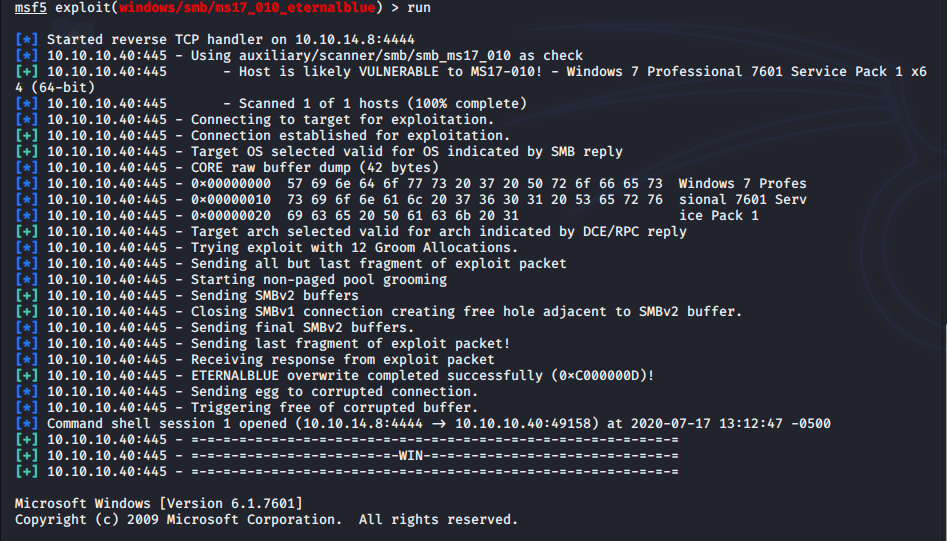

Name: Blue
IP:   10.10.10.40
OS:   Windows

This one is probably going to be rather easy considering it's named Blue and EnternalBlue is a notable attack against Windows systems.  Lets jump in.

I ran a Nmap scan against the host and it came back vulnerable to MS17-010, AKA EternalBlue.

    sudo nmap --script vuln -oN nmap/vulnscript 10.10.10.40
    Starting Nmap 7.80 ( https://nmap.org ) at 2020-07-17 13:00 CDT
    Nmap scan report for 10.10.10.40
    Host is up (0.031s latency).
    Not shown: 991 closed ports
    PORT      STATE SERVICE
    <snip..>
    Host script results:
    | smb-vuln-ms17-010: 
    |   VULNERABLE:
    |   Remote Code Execution vulnerability in Microsoft SMBv1 servers (ms17-010)
    |     State: VULNERABLE
    |     IDs:  CVE:CVE-2017-0143
    |     Risk factor: HIGH
    |       A critical remote code execution vulnerability exists in Microsoft SMBv1
    |        servers (ms17-010).
    |           
    |     Disclosure date: 2017-03-14
    |     References:
    |       https://blogs.technet.microsoft.com/msrc/2017/05/12/customer-guidance-for-wannacrypt-attacks/
    |       https://cve.mitre.org/cgi-bin/cvename.cgi?name=CVE-2017-0143
    |_      https://technet.microsoft.com/en-us/library/security/ms17-010.aspx
  
    Nmap done: 1 IP address (1 host up) scanned in 111.35 seconds
  
This exploit's pretty easy to do, which adds to the criticality of it.  Lauched Metasploit and ran the windows/smb/ms17_010_eternalblue module against the host.

That was easy.  Lets see who we are.

photo of system.
