Hostname: Bounty  
IP: 10.10.10.93  
OS: Windows  

Just a normal nmap scan. Only has port 80 open.
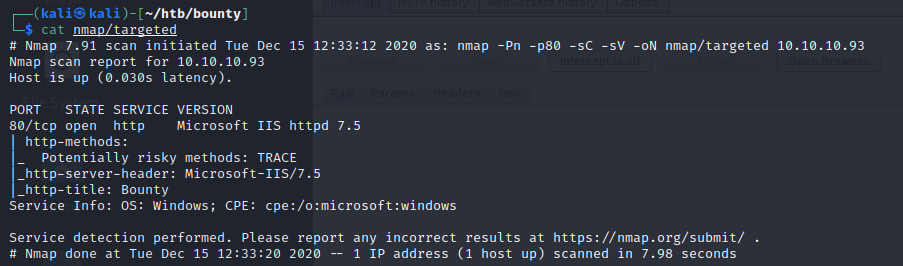
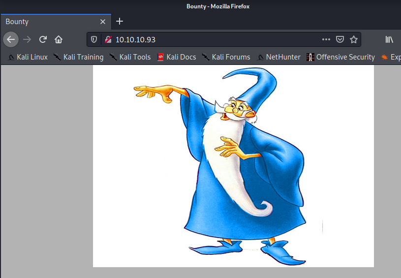

Interesting page, nothing much. Running Nikto/Gobuster to see if we can find anything.

Nikto said it's an asp.net page  
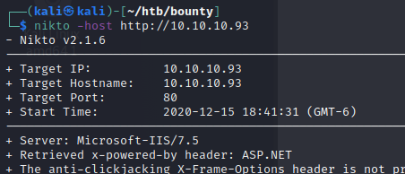

restarting gobuster with asp/aspx extensions.  
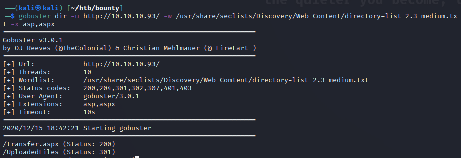

Couple of interesting pages. Lets check out transfer.aspx  

Looks like a file upload. Lets try to upload a shell.  
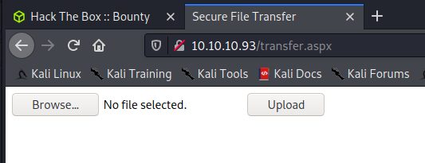

Looks like my asp/x files don't upload..  
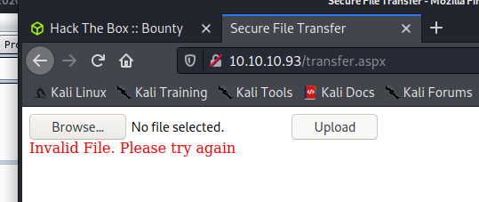

I searched how to bypass an aspx file upload and the first result was promising

Uploaded the web.config file they had on the site.
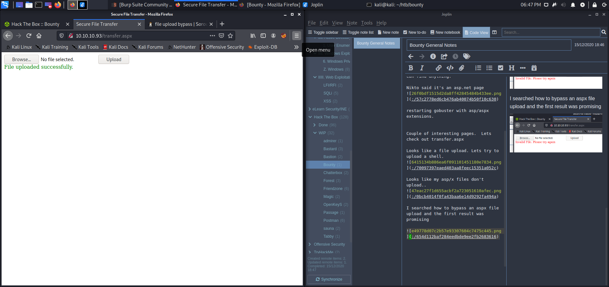

Looks like it worked, lets check the uploadedfiles directory

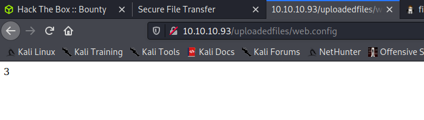

According to the script, if it says 3, it's executing code. So lets try to get some command execution.

Couldn't get any text to output to the webpage, but I stumbled upon a website that suggested trying to ping ourselves while having tcpdump running. Something i've seen done before but always forget to try.

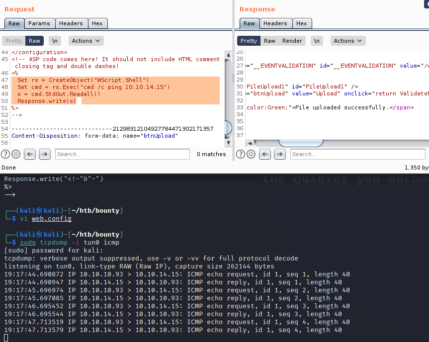

Looks like we have code execution, it's just not visible on the webpage. lets try to get a shell.

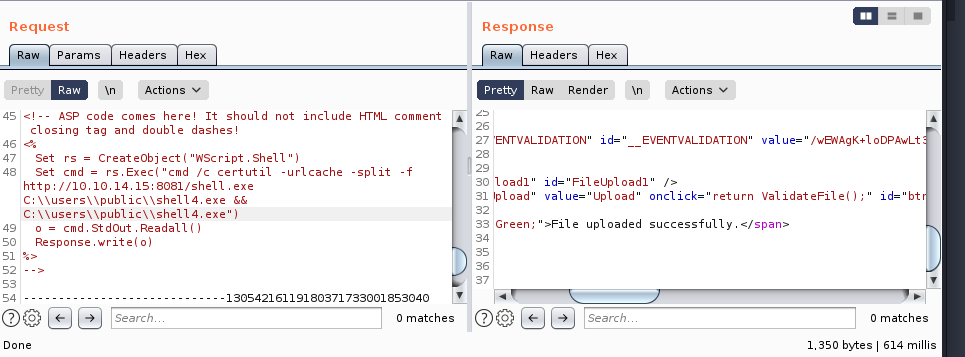

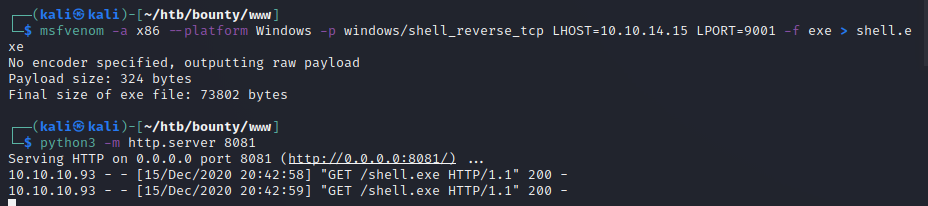

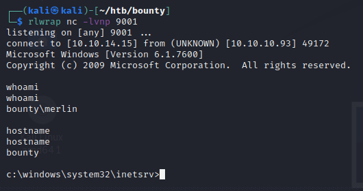

Low level shell. not bad. Lets take a look at this system.
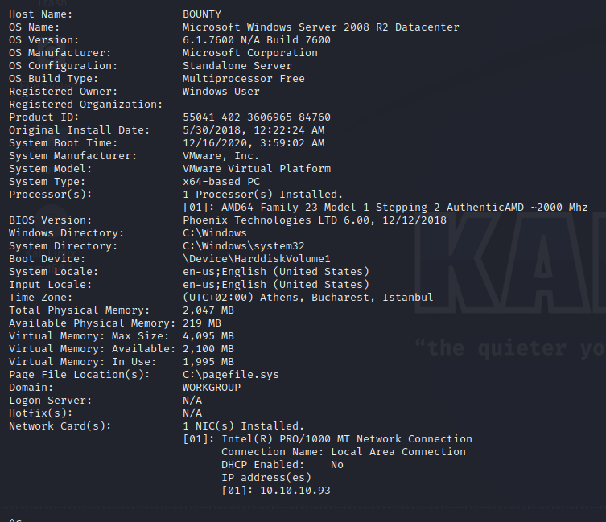

N/A on hotfixes for a Win 08 R2 system? oh no..

Transfered over CVE-2018-8120 and nc.exe
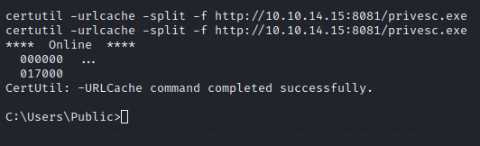

Verified the CVE worked. then used it to launch a nc session as system.

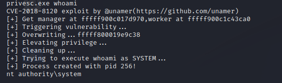

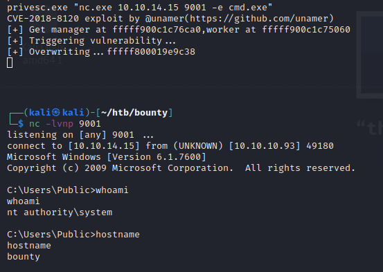
