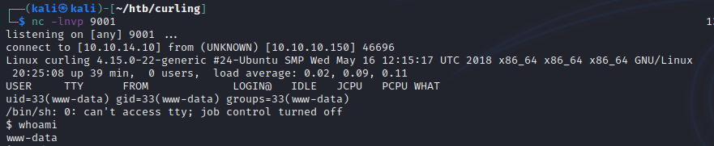
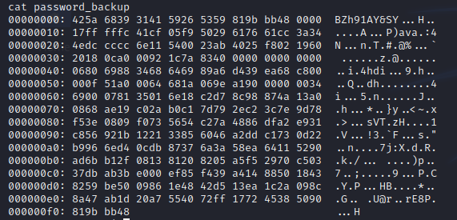

Curling
10.10.10.150
Linux

Started off with an nmap scan
    
    sudo nmap -Pn -vv -sV -oN nmap/initial 10.10.10.150

ssh and webserver, lets look at the webserver

quick check of robots.txt and secret.txt, robots was nothing, but secret was something.

Lets try base64 first  

Hmm, that looks like a password. Looking at the homepage, one of the articles if signed with 'floris'. Lets try it.
![](./resources/curling/ba4c04e374b892cc99ffacb8f8b85a1e.png

we're in  

kinda..

While I was doing this I had gobuster and dirb going in the background. Out of all the stuff it found, one thing stuck out more than the rest, /administrator/

This took me to a joomla admin page, and we know floris works. lets log in

Nice! Lets see if we can get a shell. I have limited knowledge of Joomla, so I googled a way to do that and came across this article.
https://www.hackingarticles.in/joomla-reverse-shell/

I followed the steps within that article and...
www-data shell!

within the home directory of floris we found a 'password_backup'

looks to be a hexdump of something. After some messing around
  
eventually got to  

That sure looks like a password  

And we've got user/user.txt  

Within his home directory there are a couple of interesting files

I tried messing with these for a while until I got a nudge to look elsewhere. Looked at the snap version and it appeared vulnerable to CVE-2019-7304. This wasn't out at the time of the boxes release so it's probably unintended, but currently I'm not sure how to do it with curl.

