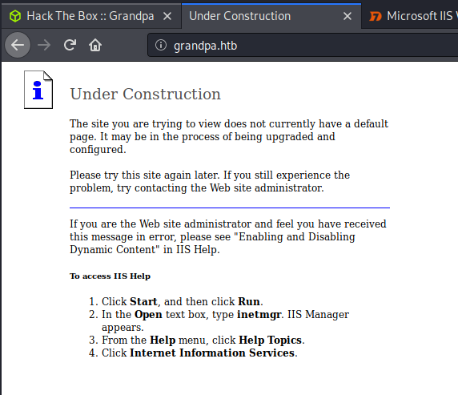
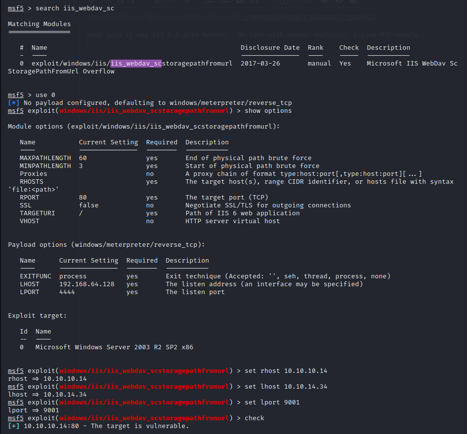
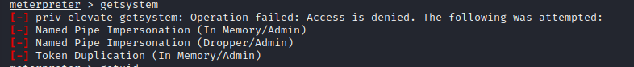
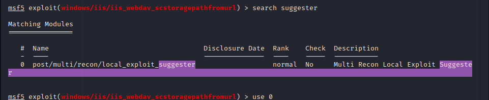
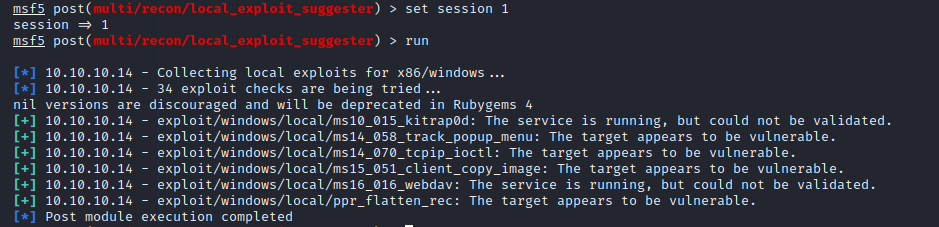
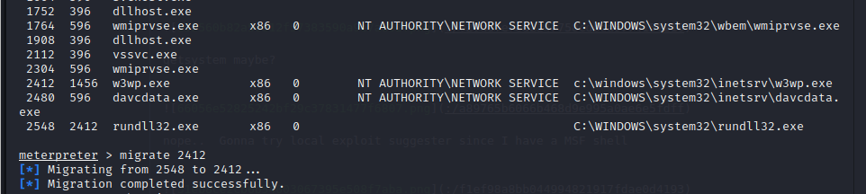
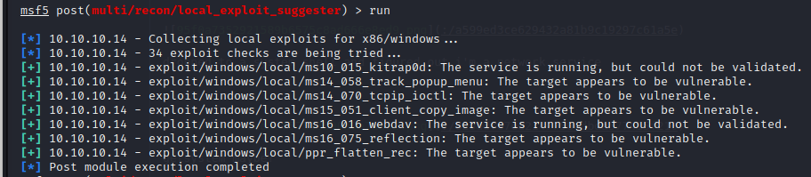
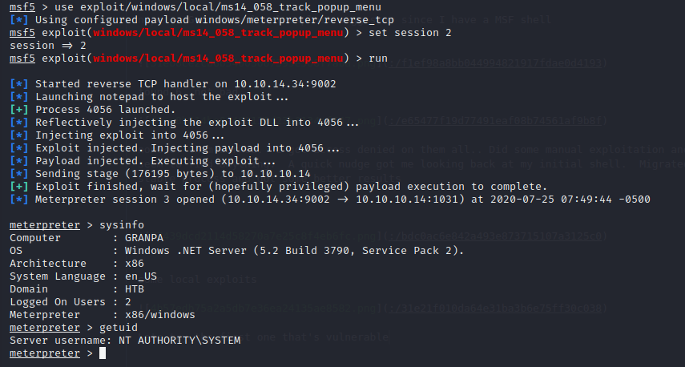

Name:   Grandpa  
OS:     Windows  
IP:     10.10.10.14  

This was another fun Windows box, from what I recall, I did this with Metasploit again.  Pretty sure I did this really early on as well, some of my notes hint at not pivoting to a more stable service after getting a shell.  Anyway, lets get started.  Here is the nmap scan(missing a screenshot, but I have the text).

    sudo nmap -sC -sV -O -oN nmap/initial 10.10.10.14
    Nmap scan report for grandpa.htb (10.10.10.14)
    Host is up (0.030s latency).
    Not shown: 999 filtered ports
    PORT STATE SERVICE VERSION
    80/tcp open http Microsoft IIS httpd 6.0
    | http-methods:
    |_ Potentially risky methods: TRACE COPY PROPFIND SEARCH LOCK UNLOCK DELETE PUT MOVE MKCOL PROPPATCH
    |_http-server-header: Microsoft-IIS/6.0
    |http-title: Under Construction
    | http-webdav-scan:
    | WebDAV type: Unknown
    | Public Options: OPTIONS, TRACE, GET, HEAD, DELETE, PUT, POST, COPY, MOVE, MKCOL, PROPFIND, PROPPATCH, LOCK, UNLOCK, SEARCH
    | Allowed Methods: OPTIONS, TRACE, GET, HEAD, COPY, PROPFIND, SEARCH, LOCK, UNLOCK
    | Server Type: Microsoft-IIS/6.0
    | Server Date: Fri, 24 Jul 2020 14:22:32 GMT
    Warning: OSScan results may be unreliable because we could not find at least 1 open and 1 closed port
    Device type: general purpose
    Running (JUST GUESSING): Microsoft Windows 2003|2008|XP|2000 (92%)
    <snip>
    OS and Service detection performed. Please report any incorrect results at https://nmap.org/submit/ .
    Nmap done at Fri Jul 24 09:17:26 2020 -- 1 IP address (1 host up) scanned in 16.81 seconds  
    
Okay, so port 80 is open, lets take a look at the website.
 
  
nmap said it was IIS 6.0 with WebDAV. No luck with manual exploits, trying MSF module

Got a meterpreter shell, unsure of who I am

dropped to a system shell and figured out i'm a network service

getsystem maybe?

nope.. Gonna try local exploit suggester since I have a MSF shell

found 6, not bad..

none of them worked. I got access denied on them all.. Did some manual exploration and didn't seem to find anything. A quick nudge got me looking back at my initial shell. Migrated to a more stable process and got some better results

some local exploits, found 7 this time. Will have to remember to review what process i'm running as.

Lets try the first one that's vulnerable

Annnddd we're system.
