Name: Academy  
OS: Linux  
IP: 10.10.10.215

This was my first box post OSCP, lets see how much i've learned.  I started off with an nmap script.

Looks like ports 22 and 80 are open.  22 tends to be a pretty secure port, so lets jump to port 80 and review it.  While reviewing it, we're going to check the rest of the TCP ports. Spoiler alert, didn't find anything of note.
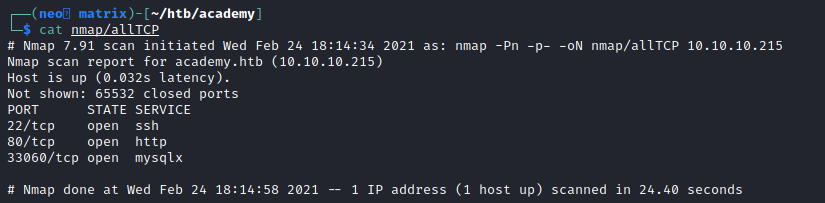

So back to port 80.  When we navigate to the IP, we get a redirect to 'academy.htb' and the page doesn't load.
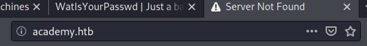

So lets go ahead and add that to our hosts file
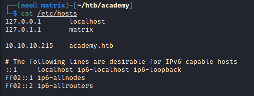

And now it loads up a pretty sparse page.  We only see a login and register option.
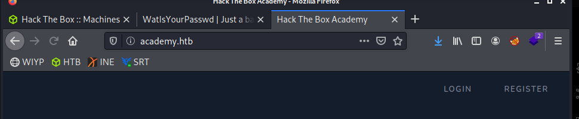

I tried some basic creds, such as admin:admin and admin:password, but neither of them worked. So I went ahead and registered my own account to review more of the application.
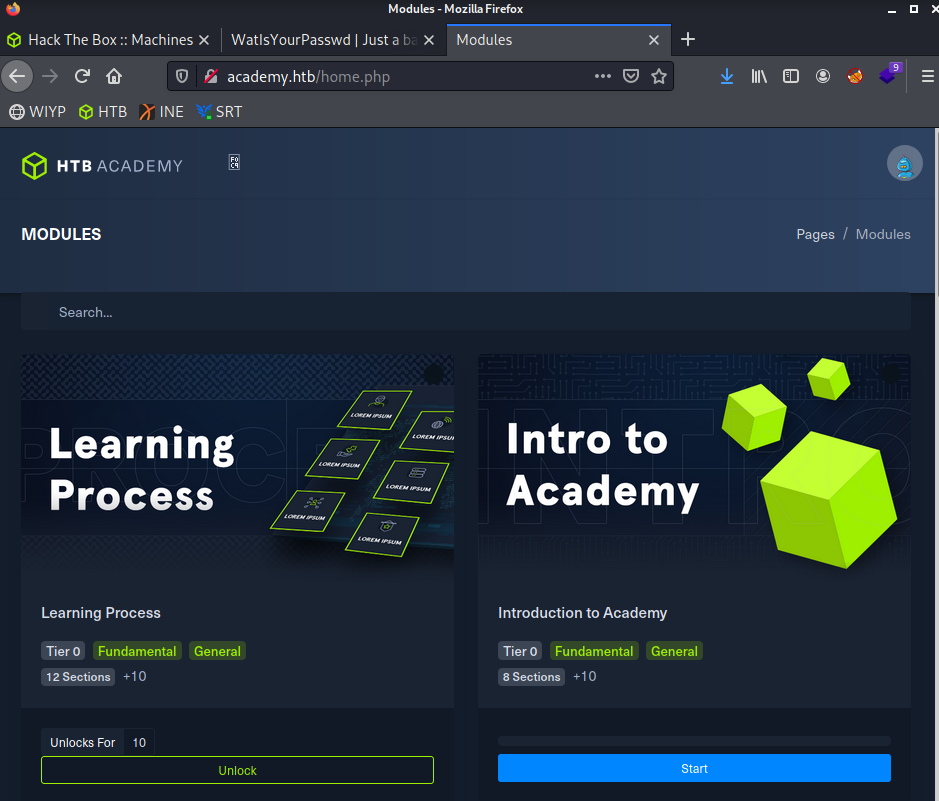

We're now granted with a pretty standard looking page, however, none of the links work.  So at this point, i'm unsure of the point of this.  Wanting to do some more enumeration, I spun up nikto and gobuster while I reviewed the page manually.
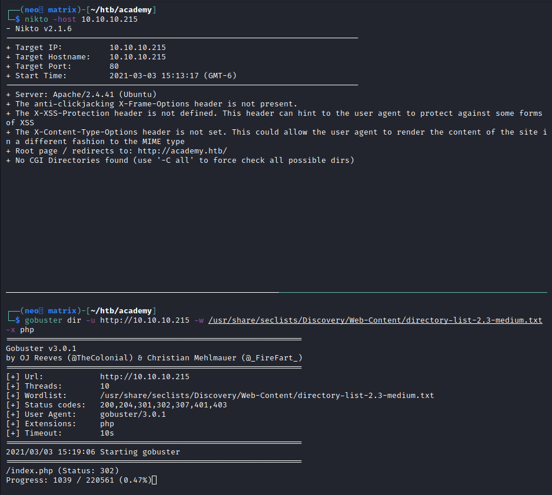

After manually reviewing the page, I didn't find much.  I decided to spin up BurpSuite and review the register option.  Maybe it'll pass parameters or something that I can modify.
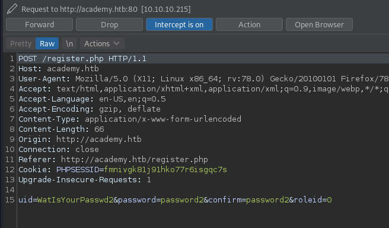

Pretty standard stuff, however the 'roleid=0' stood out to me. So lets change that to a 1.  
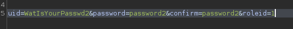

But when we logged in, nothing changed.  Hmm...  Nothing on the gobuster/nikto scan either.  Lets think about the logic here for a second though.  If the the role ID of a normal user is 0, I'd presume the 1 is for an admin.  There could be more, but this is probably a good place to start.  So maybe there is an admin page?  Since it's running PHP, lets try admin.php.
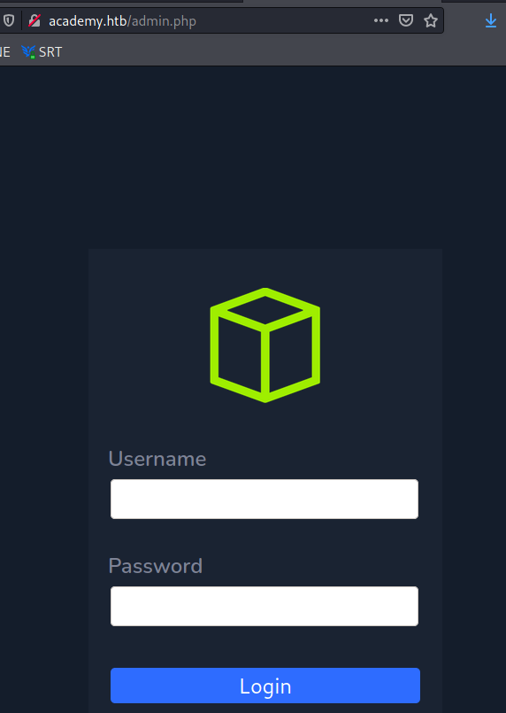

Awesome, lets see if our user can log in.

Nice!  So this gives us something, the last to do list item, 'fix issues with dev-staging-01.academy.htb'.  So lets add that to our hosts file and browse to that site. 
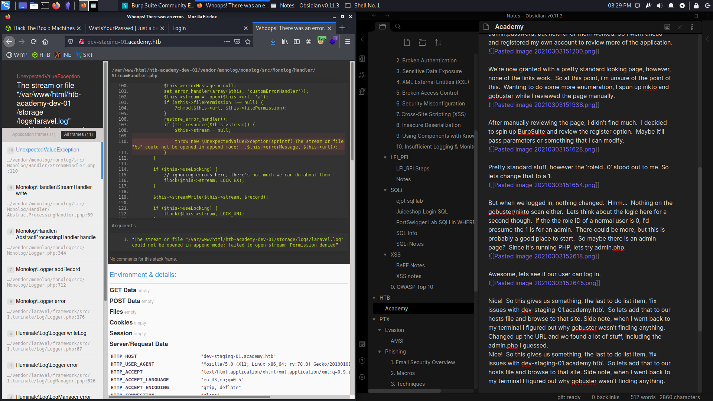

Side note, when I went back to my terminal I figured out why gobuster wasn't finding anything.  Changed up the URL and we found a lot of stuff, including the admin.php I guessed.
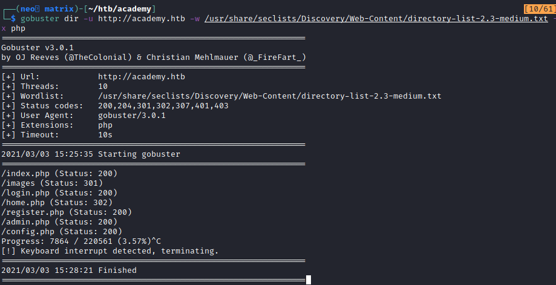

So this is a lot, I have no idea whats going on here, but there are a few interesting aspects, some api keys, usernames, and passwords.
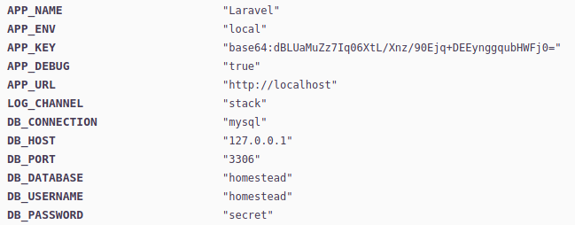

I looked around and tried a few things and didn't get anywhere, so I started googling the name of the application and exploit, and found a couple interesting things.
https://www.exploit-db.com/exploits/47129
https://www.rapid7.com/db/modules/exploit/unix/http/laravel_token_unserialize_exec/
https://www.exploit-db.com/exploits/49424

I couldn't find the version number on the webpage, however the parameters for the Metasploit exploit seemed to require what I've got.  So maybe that'll work?  Lets see if we can avoid MSF though.

I found this exploit on Github.  Reading the README.md file makes it sounds like it might work...
https://github.com/aljavier/exploit_laravel_cve-2018-15133

Looks like it needs the URL and the API key.
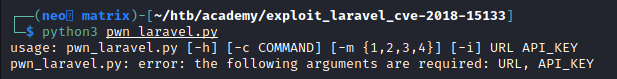

So I ran the exploit, and verified a few things(user, hostname, ip)
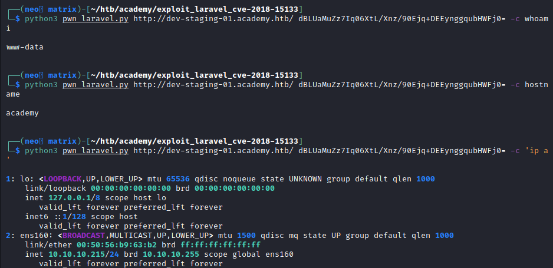

Looks like this exploit also has an interactive mode, what a nice exploit.
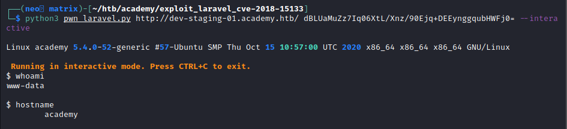

Cool, lets see if we can escalate up to root.  Well, it appears I can't change the directory I am. Lets get our own shell.
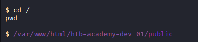

Well, that didn't work...

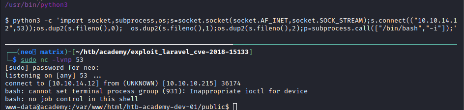

Have quite a few users in the home directory, lets see who we should target
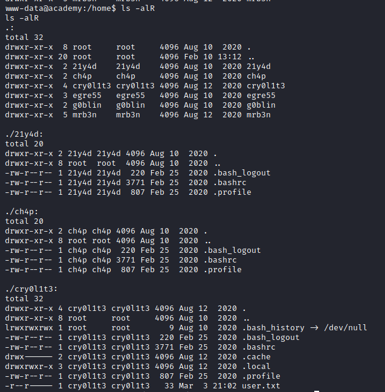

Looks like 'cry0l1t3' is a good target.  Lets enum our local system and keep that in mind.

Ran Linpeas and didn't see anything of note.  Also manually reviewed files and didn't find anything that stuck out.  I went to look at the webfiles thinking that maybe some of them contained creds or something. Eventually I found a .env file that contained db creds that were different than the ones on the dev site.
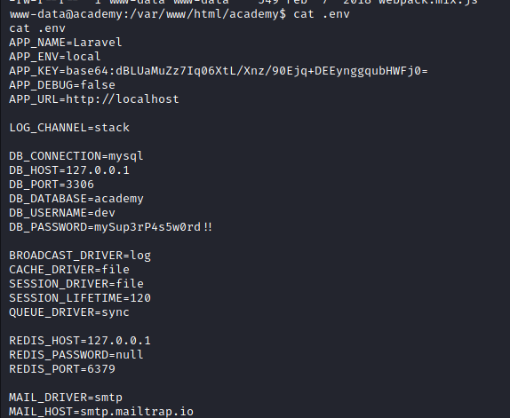

dev:mySup3rP4s5w0rd!! But this wasn't working...
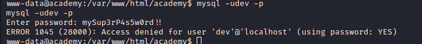

So maybe we try with some of the users in the home directory?  password reuse is a wonderful thing.  I tried 'cry0l1t3' first and nothing happened.  Or so I thought, turns out my shell just changed.
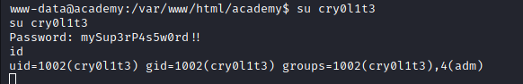

So now on to root..
I ran linpeas and noticed something
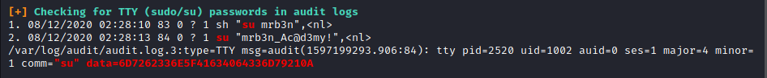

That data string looks interesting, potentially hex?  only numbers and capital letters before F
Using good ol' cyberchef we decode it..
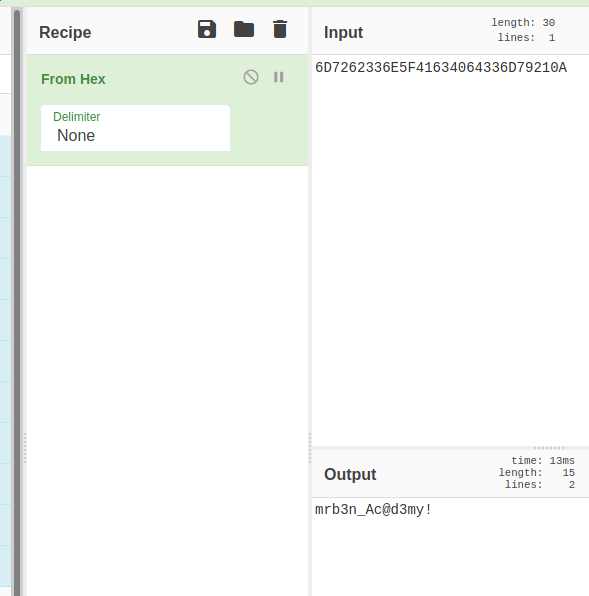

After a quick su, we're now mrb3n.
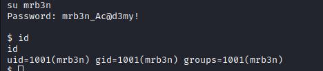

one of the first checks I do when I have the password is 'sudo -l' so lets see what we can do.
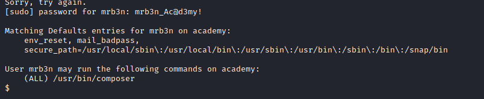

And a quick glance at GTFObins, tells us what to do
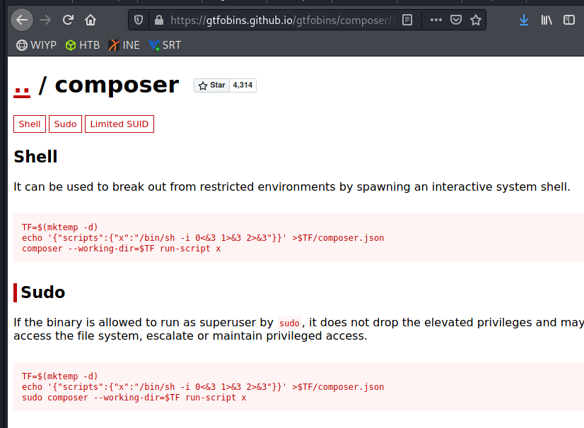

and rooted!
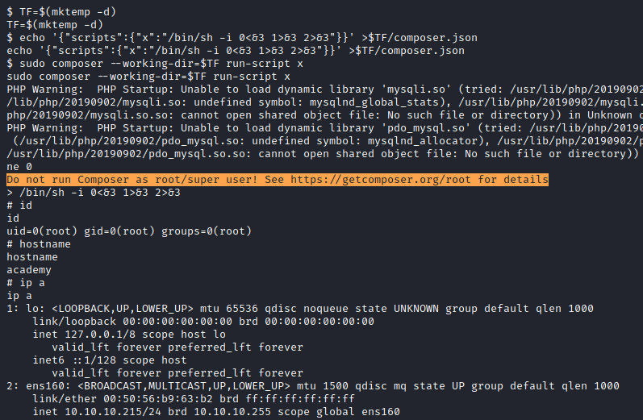
