Name:   Artic  
OS:     Windows  
IP:     10.10.10.111  

To start off on Artic I ran my normal Nmap scan and found ports 135, 8500, and 49154 open.

    sudo nmap -Pn -vv -sV -oN nmap/initial 10.10.10.11

Looking at ports 135 and 49154 I found no leads, however port 8500 appeared to be a CMS site, specifically for Adobe Coldfusion 8.  

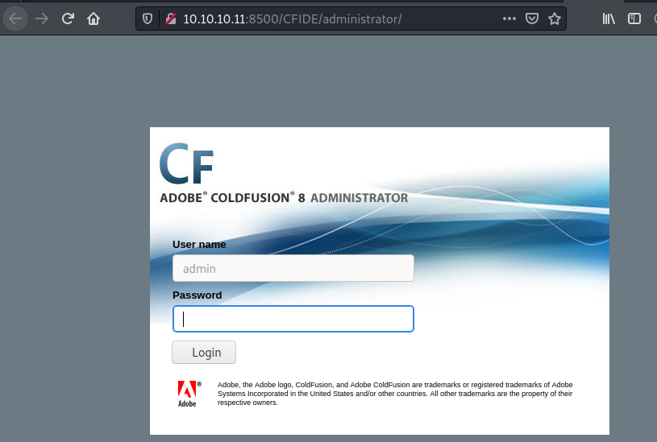

Looking for some premade exploits via Searchsploit leads us to quite a few options. 

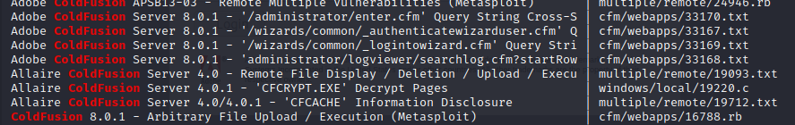

After going through a few of the exploits, we land on a Directory Traversal exploit.  

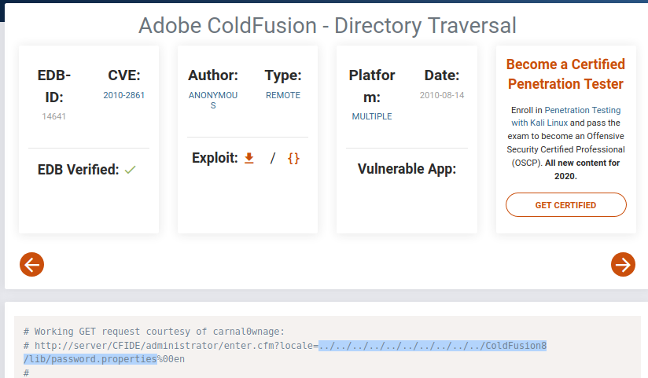

Running this exploit  gives us something promising.

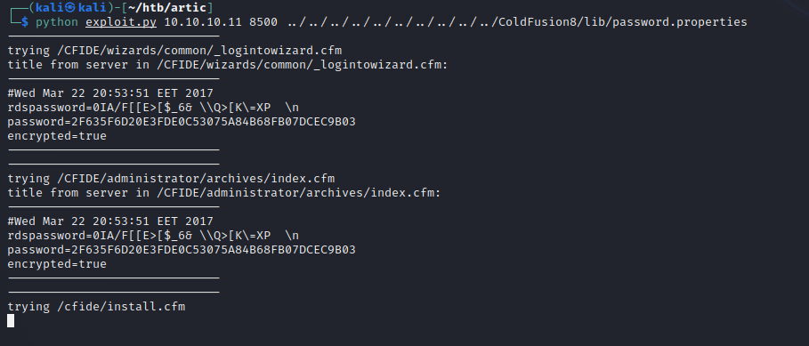

Based off the 'encrypted=true' I'm going to assume it's hashed in some way.  So lets pass this over to John and see if we can crack it.   

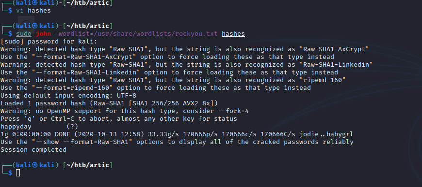

Success!  Looks like we have a password now.  Based off my notes, I don't believe we know the username at this point, so lets try some default ones, starting with 'Administrator'

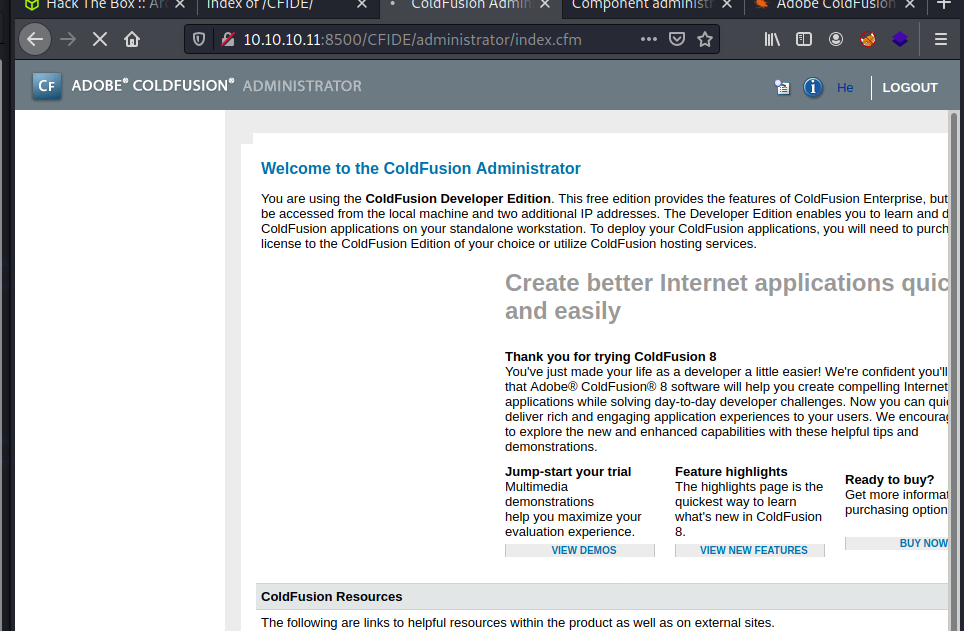

We're in!  
Looking around for methods of getting a shell, I stubmled upon this [youtube video](https://www.youtube.com/watch?v=NRMhZ3tofpM) showing me how.    

Following along, I was able to get a shell.  
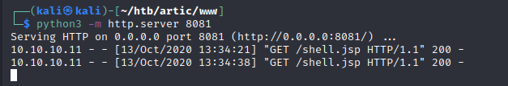

When I did this, I struggled with Windows boxes some, so I pivoted to the MSF route.  I used Powershell to download a meterpreter embeded file and upgraded my shell.  This was before I knew about the Shell_to_Meterpreter Module within Metasploit.

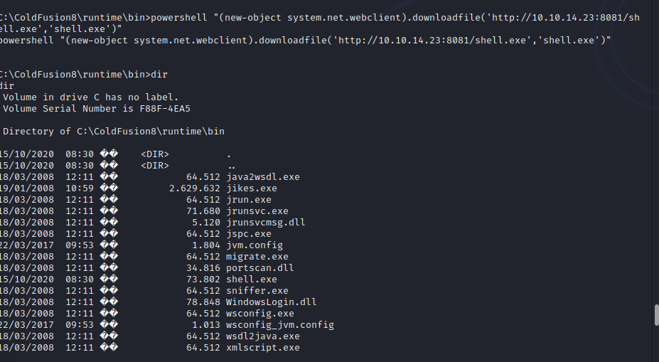

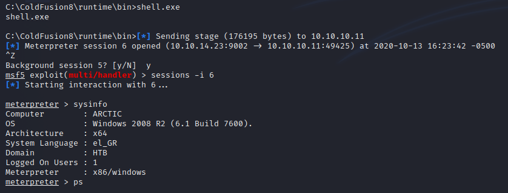

Pretty sure after upgrading I probably migrated to a more stable sounding service, don't have a screenshot though.  Since we're using Metasploit, I feel like the next step would be to run local exploit suggester to see what options we have.

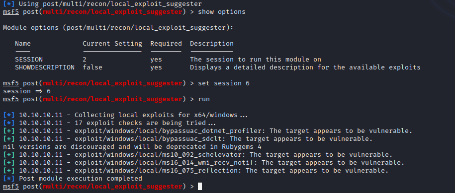

Looks like this system is vulnerable to an it called Schellavator, so lets try that because the name sounds cool.

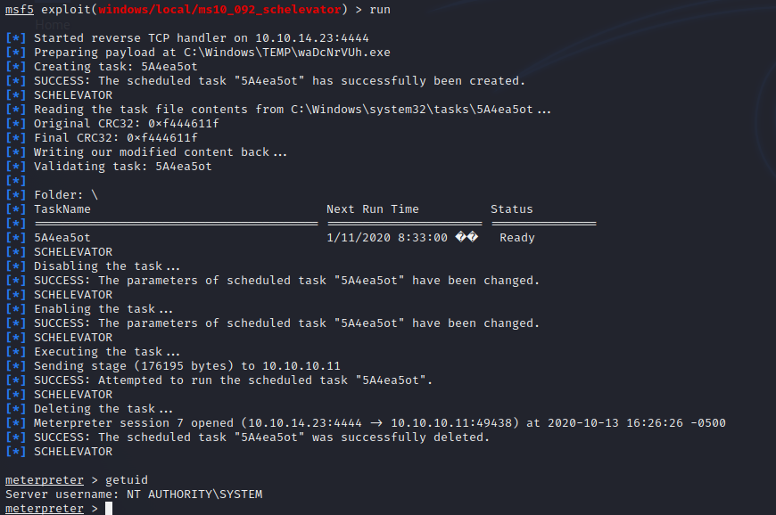

And now we're system.  Pretty fun and simple box.
