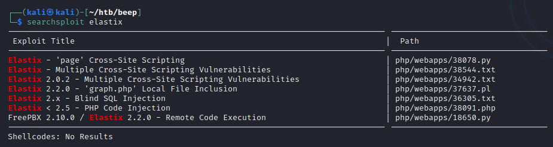
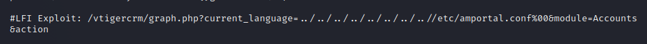
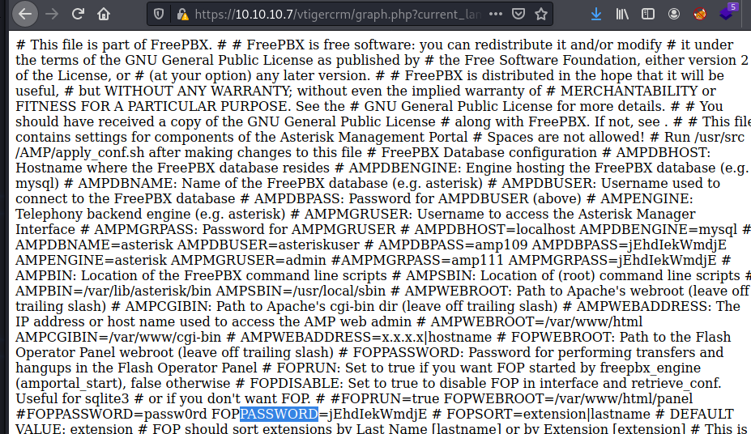
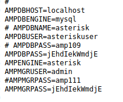
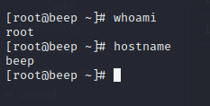

Name:   Beep  
OS:     Linux  
IP:     10.10.10.7  

From what I remember, this box was pretty easy and had a lot going on.  So lets get started.  Below is my initial nmap scan.
    
    sudo nmap -Pn -vv -sV -oN nmap/initial 10.10.10.7
    
So a lot of ports open.  I went down the list, skipping port 22 and 80/443 as I would come back to those.  I ran through some searchsploit results and nothing stuck out as a low hanging fruit/easy win, so I went to port 80/443.  it appears to be running an Elastix system, but I wasn't able to figure out a version number.  Despite that, one of the searchsploit results mentioned a LFI, so I tried that.

  
  
  

Looks like we got some creds.  Since the box is running SSH, it doesn't hurt to try those creds and hope for some password reuse.  Something I always like to try, but only document when it works.

Well, the username Administrator didn't work, however this is a linux box, so lets try the username root as well.

Well, that was easy, however password reuse is a real issue from what I've read and seen in the industry.
