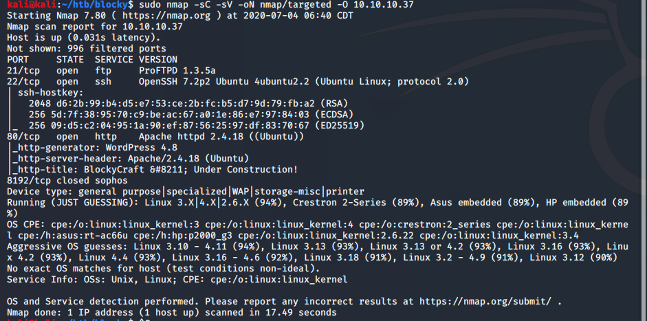
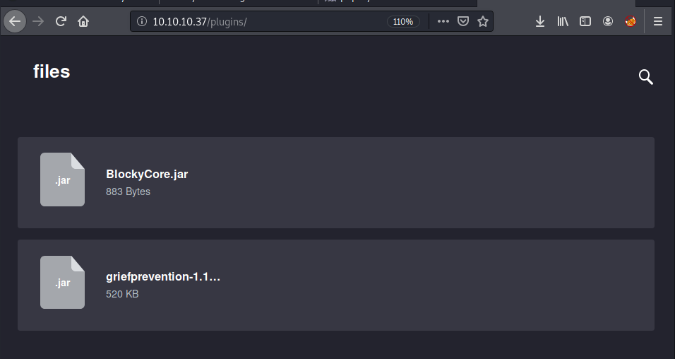
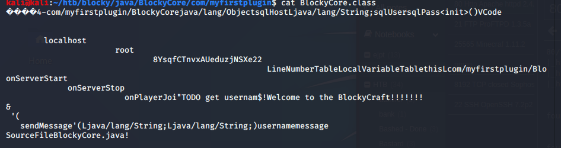
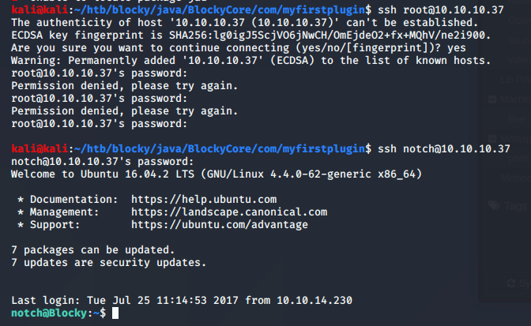
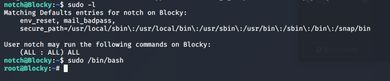

Name:   Blocky  
OS:     Linux  
IP:     10.10.10.37  

This was another rather easy box. It appears to be emulating that of a Minecraft server.  Curious if someone turns the box on, could we actually play Minecraft?  Anyway, lets get started. Below is my nmap scan.

    sudo nmap -sC -sV -oN nmap/targeted -O 10.10.10.37
    and
    sudo nmap -p- -oN nmap/allports 10.10.10.37
    and then
    sudo nmap -p 25565 -sC -sV 10.10.10.37

So it looks like ports 21, 22, 80, 2192, and 25565 are all open. Pretty straightforward ports with the execption of 25565.  Some additional research into that one and it appears to be a Minecraft server, ties in with the name Blocky nicely.

Enumerating port 80 as the others appeared to be dead ends for now, we stumble upon a Minecraft themed Wordpress page.  We also find a directory called /plugins/ with some interesting jar files.  These might contain some interesting info, so lets download them.  

Went ahead and decombined BlockyCore.jar which is essentially a folder with java files.  Reading through the contents, one of them appears to list some credentials.  

Like the last machine we did, we did not have any luck using those creds on WordPress, so lets try SSH.  The username root did not work, so we tried notch which we pulled from WordPress and it allowed us in.

Lets check some basic Linux Priv Esc shall we
    
    sudo -l
    
Oh, that's promising, and now we're root.

