Name: Forest
IP: 10.10.10.161
OS: Windows

Started off with an nmap scan.

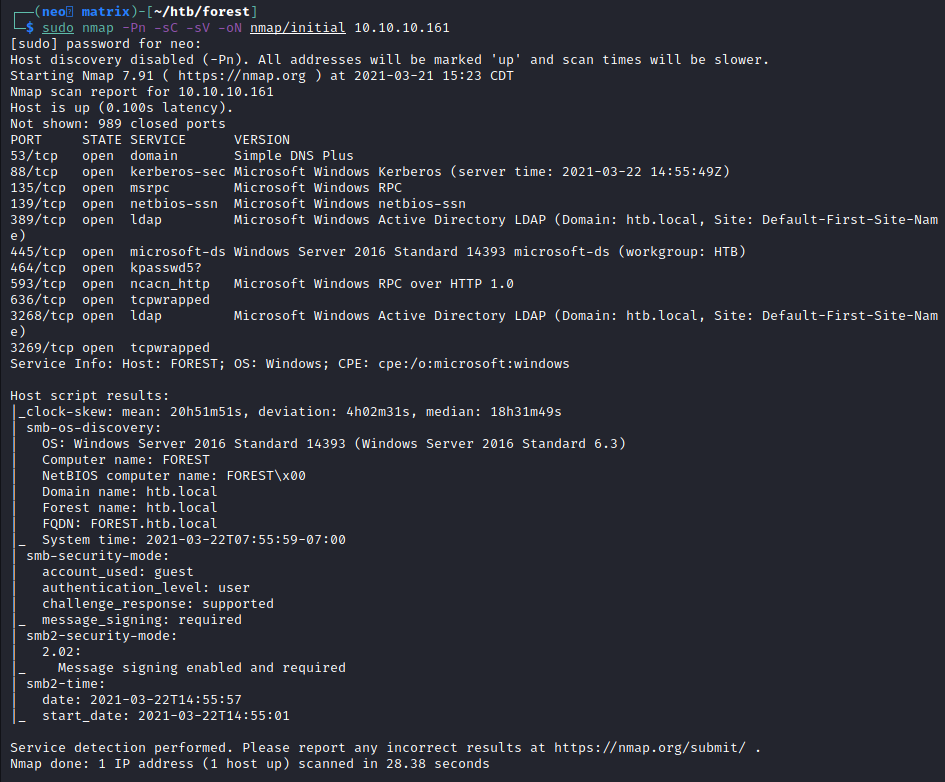

A few interesting ports, 53 for DNS, 389 for LDAP, 445 for SMB. Based off all these, it appears to be a domain controller.

Tried a zone transfer because 53 was open, and it failed.

Ran enum4linux and looks like we have some usernames.

Administrator
Guest
krbtgt
DefaultAccount
sebastien
lucinda
svc-alfresco
andy
mark
santi

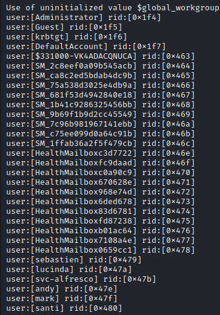

welp, no aspreproasting...

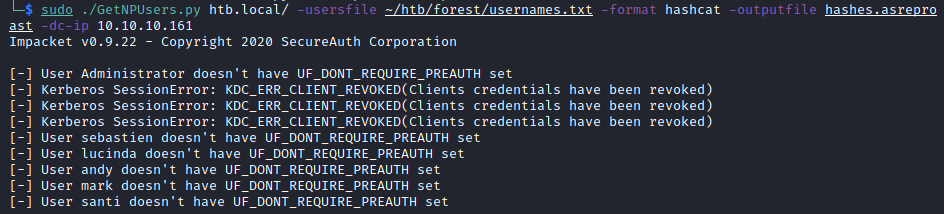	

wait! one of the accounts, didn't produce an error, lets check the output file

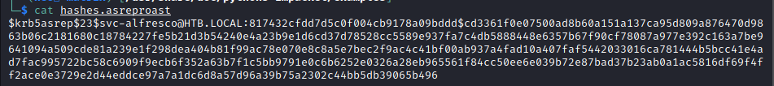

We now have a user:pass combo!

svc-alfredo:s3rvice

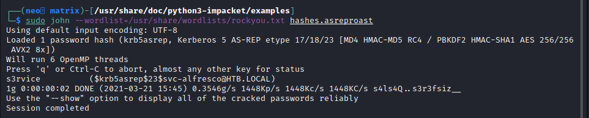

Looks like port 47001 is running winrm, so lets connect using evil-winrm.

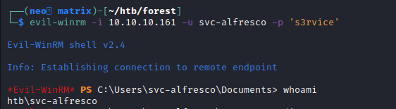

Since this is also an AD account, lets use Bloodhound to find the shortest path to DA

Well, it's a bit of a mess, but here's the overall map

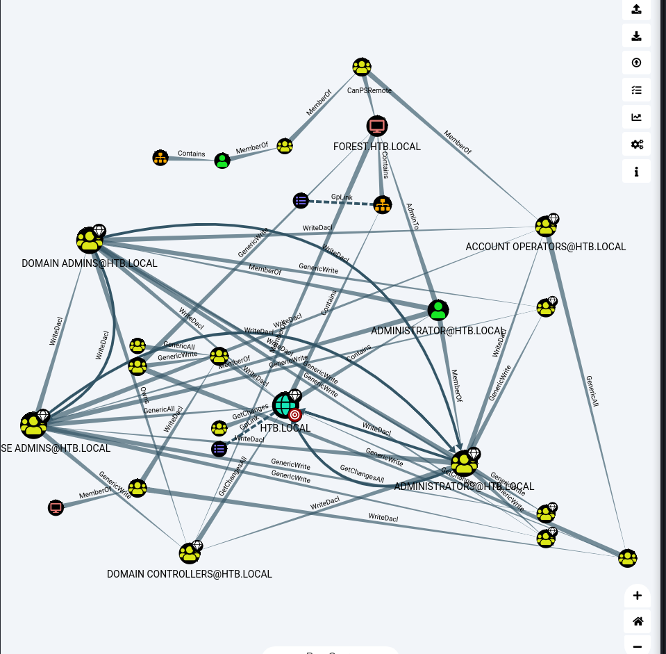

Going to fine tune it a bit using the ''Find Shortest Paths to Domain Admins" query.

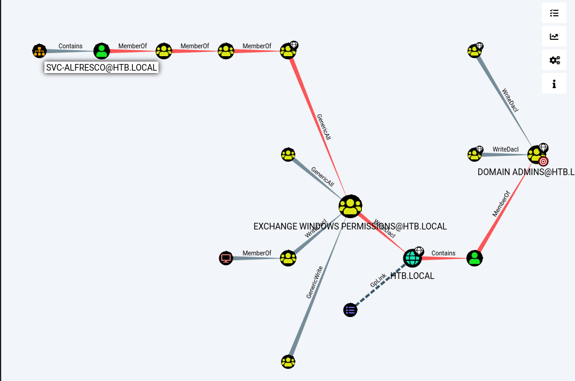

We're in the top left, and it looks like we have a way, lets review it.

As svc-alfresco, we're a member of 'Service Accounts' which is a member of 'privledged IT Accounts' which is a member of 'Account Operators' which connects to 'Exchange Windows Permissions' which has a 'WriteDacl' to HTB.local.  So summarizing WriteDACL from adsecurity.org
https://adsecurity.org/?tag=writedacl we basically can create a user with special permissions.

So lets do that.
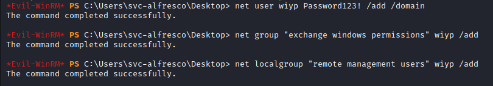	

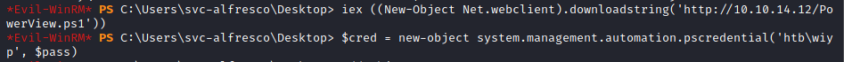

Re ran some of the commands because I was getting some errors and I had a feeling this is the intended path.

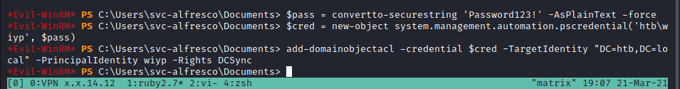

fffuuuuu, silly non-writable directory...

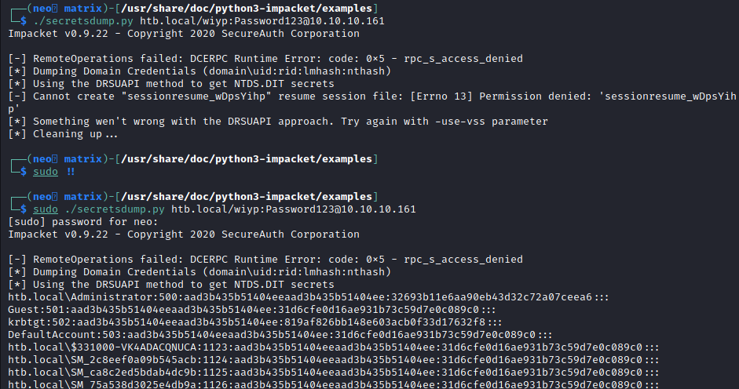

lets pass that hash and get admin/system access

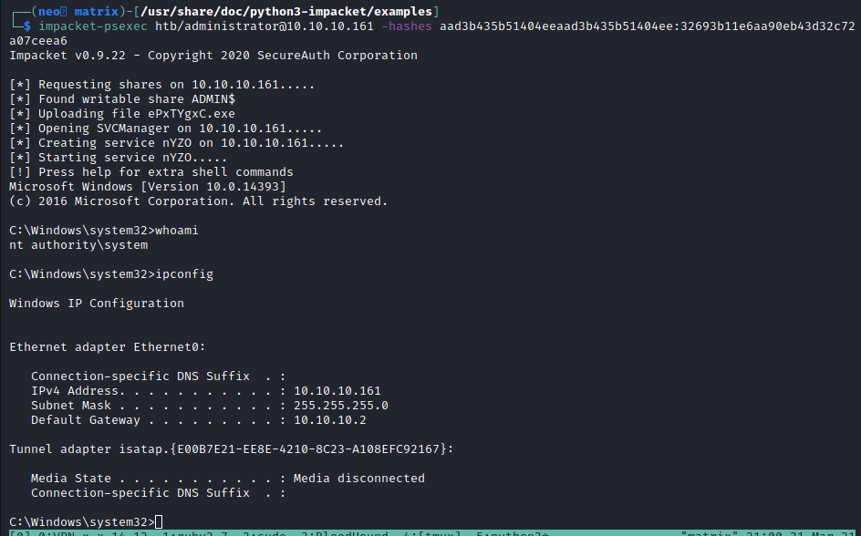

and I just wanted to double check I had DA
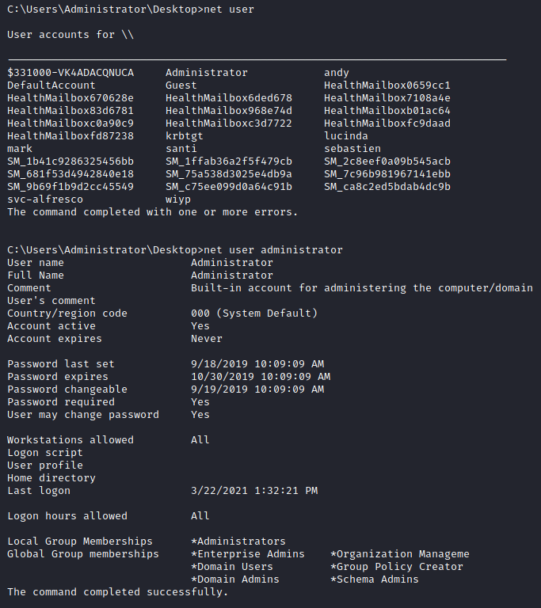
