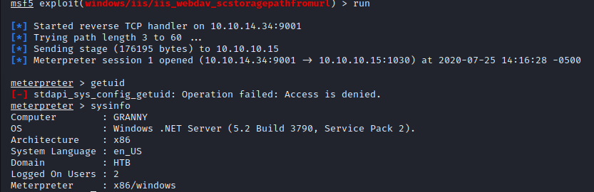
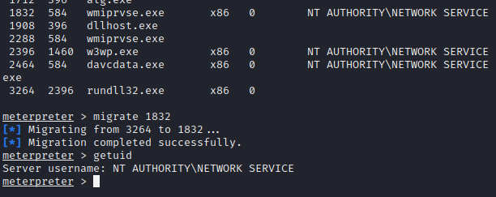
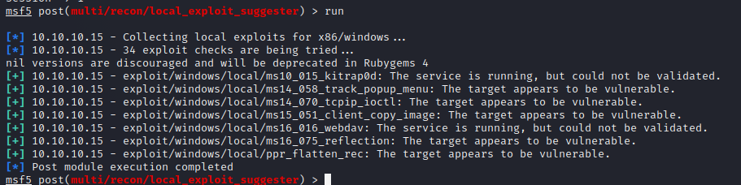
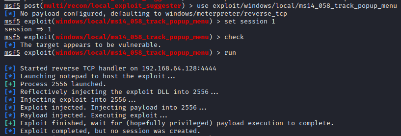
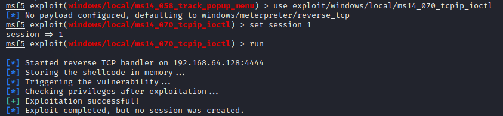
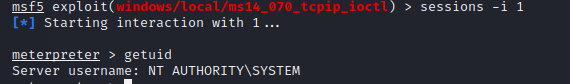
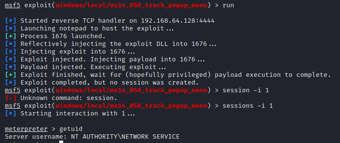

Name:   Granny  
OS:     Windows  
IP:     10.10.10.15  

From what I remember of this machine, it was pretty much the same as Grandpa.  So lets dive in.  Here is the nmap scan as well as the output text since I didn't get a screenshot of it.

    sudo nmap -sC -sV -oN nmap/initial 10.10.10.15
    
    Starting Nmap 7.80 ( https://nmap.org ) at 2020-07-25 14:12 CDT
    Nmap scan report for granny.htb (10.10.10.15)
    Host is up (0.058s latency).
    Not shown: 999 filtered ports
    PORT STATE SERVICE VERSION
    80/tcp open http Microsoft IIS httpd 6.0
    | http-methods:
    |_ Potentially risky methods: TRACE DELETE COPY MOVE PROPFIND PROPPATCH SEARCH MKCOL LOCK UNLOCK PUT
    | http-ntlm-info:
    | Target_Name: GRANNY
    | NetBIOS_Domain_Name: GRANNY
    | NetBIOS_Computer_Name: GRANNY
    | DNS_Domain_Name: granny
    | DNS_Computer_Name: granny
    |_ Product_Version: 5.2.3790
    |_http-server-header: Microsoft-IIS/6.0
    |http-title: Under Construction
    | http-webdav-scan:
    | WebDAV type: Unknown
    | Public Options: OPTIONS, TRACE, GET, HEAD, DELETE, PUT, POST, COPY, MOVE, MKCOL, PROPFIND, PROPPATCH, LOCK, UNLOCK, SEARCH
    | Server Date: Sat, 25 Jul 2020 19:18:27 GMT
    | Server Type: Microsoft-IIS/6.0
    | Allowed Methods: OPTIONS, TRACE, GET, HEAD, DELETE, COPY, MOVE, PROPFIND, PROPPATCH, SEARCH, MKCOL, LOCK, UNLOCK
    Service Info: OS: Windows; CPE: cpe:/o:microsoft:windows

    Service detection performed. Please report any incorrect results at https://nmap.org/submit/ .
    Nmap done: 1 IP address (1 host up) scanned in 20.33 seconds

So lets get started with port 80. Same msf module as grandpa    
  

have a user shell  

  

same migration process, background, local exploit suggester.  

  

started with ms14-058, tried it a few times, no luck.  

  

Trying ms14_070 next.  

  

said it was successful. But no new session, because the current session was used. Maybe this was the case with the original exploit(ms14_058).  

  

Tried it again, still didn't work, but I got system with ms14-070 and that's all that matters.  

  
