Name: Hawk
OS: Linux
IP: 10.10.10.102

Started off with a couple of nmap scans.

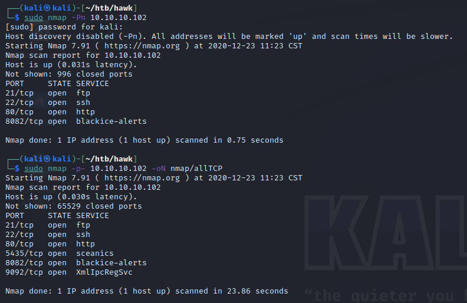
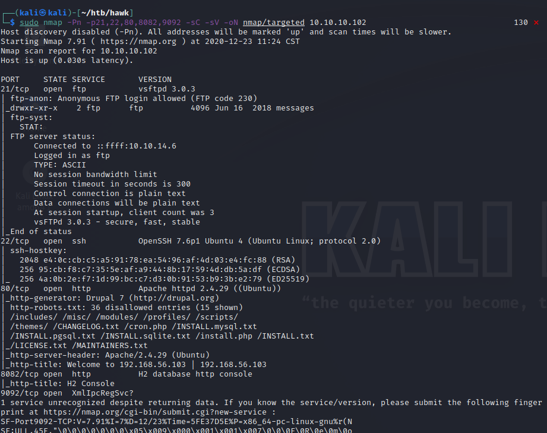

Looking at the first thing in the nmap scan we see that anonymous FTP access is allowed. This is ususally a good thing.

After diggint through the directories and checking out hidden files, we find an interesting sounding drupal file.

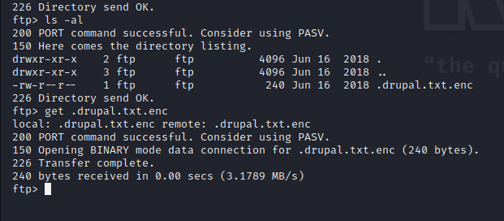

Un hide it and checked out what is was
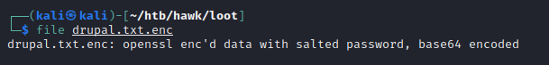

I think i'm doing this right
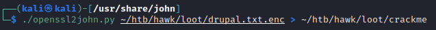

Well I started John to try and crack that, lets move on. The next thing that sticks out to me is the drupal webpage on port 80.

Messing around on the website, I stumbled upon a user creation page. I couldn't create a user, but I could enumerate that 'admin' was a user.
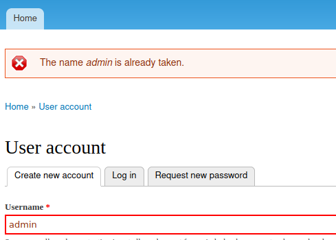

I've heard of a tool called Droopescan. So lets use this and scan the site.

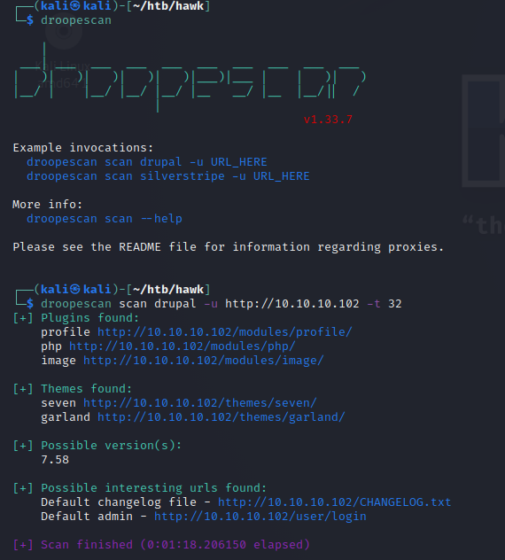

Gonna make a note of version 7.58

also making a mental note of a few authenticated RCEs. This could be our route to an initial shell on the box.
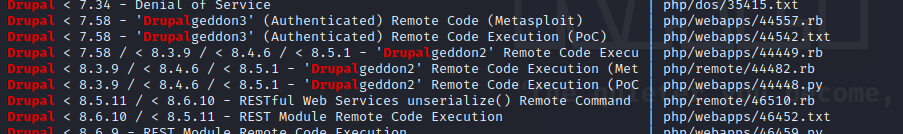

Need to keep looking for creds though

After not getting anywhere with John, I did some addititional research into openssl passwords/cracking them and stumbled upon bruteforce-salted-openssl.py. I installed that and messed with it some

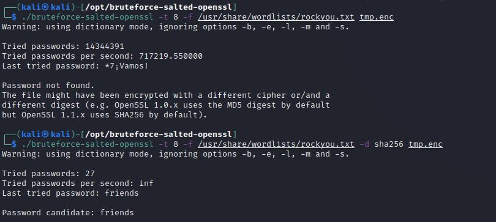

Found out I needed to specify the digest as it does md5 by default. So lets try sha-256.

So I took that password and passed it to openssl to decrypt the file and got this.
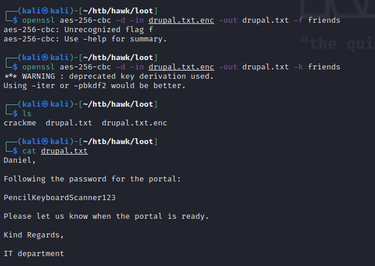

So I couldn't get the username from the note to work, however I got the other username I found earlier to work.

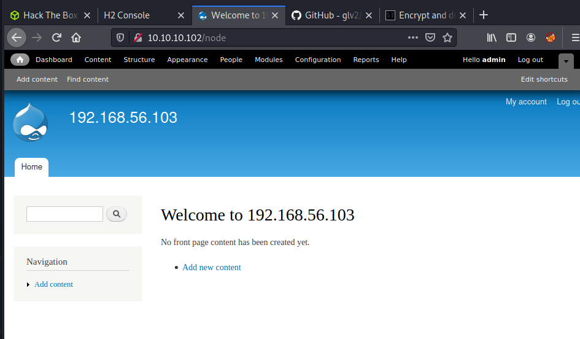

After googling 'drupal reverse shell' I landed on this page
So I followed it along, and I have a low level shell!

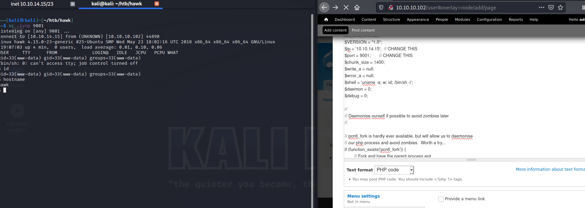

Tried some basic privesc commands and didn't get anywhere. Ran both LinEnum and LinPEAS and also didn't get anywhere. It appears mysql is running, but I don't have creds. Maybe I can find something within some drupal files as that is the only non-standard thing left to explore.

Eventually stumbled upon some creds for mysql within the settings.php file
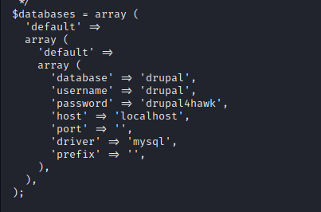

So lets try those.
Oh! looks like i'm in
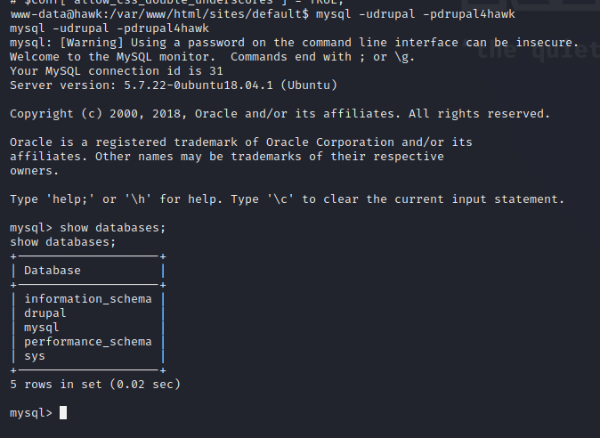

Tried a few exploits againts mysql and had no luck. Also looked through the databases for anything juicy and i'm not finding much. However someone mentioned that I already have enough info, so I tried for some password reuse. Didn't think of this earlier, should have though.

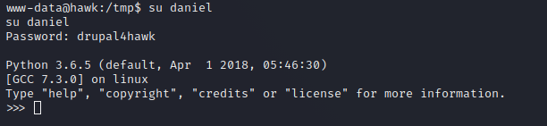

Looks like i'm in, however I'm in python which isn't ideal. lets get back to bash

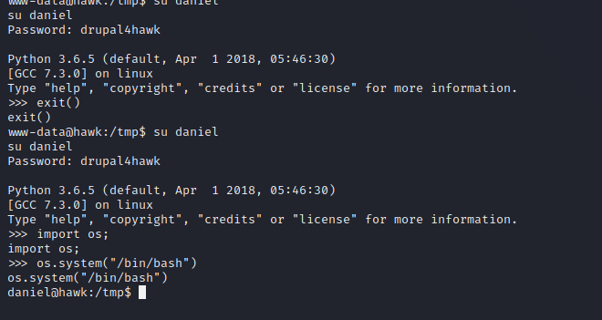

Not having any luck, I looked over my notes and saw that port 8082 had a webserver but gave an error that it's not accessable remotely.

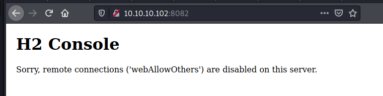
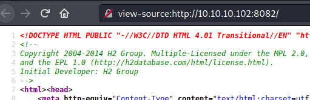

Maybe it's accessable locally?

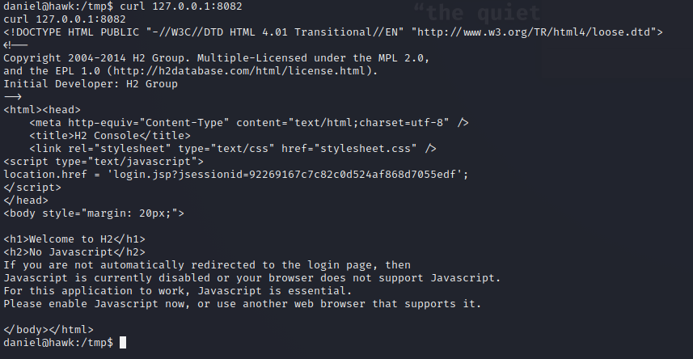

It is! Lets see what this is. Might have to look into some sort of forwarding to gain access. Looking at the srouce code from earlier, we find it's copyrighted back in 2014. Lets see if we can find any versions around then.

After some digging, I don't think the copyright gives an accurate version number. So lets set up the port forward and access the site.

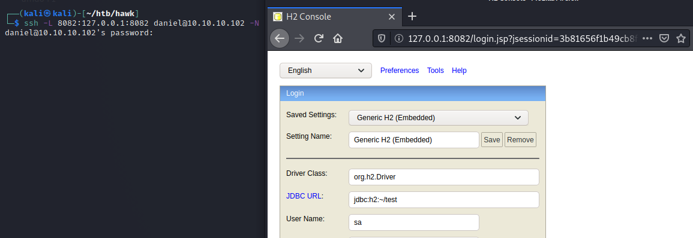

Didn't get anywhere with that page, kept saying invalid username or could not connect. Did some digging and stumbled upon a H2 exploit on ExploitDB. Downloaded it, reviewed it and ran it against my localhost/forwarded port.

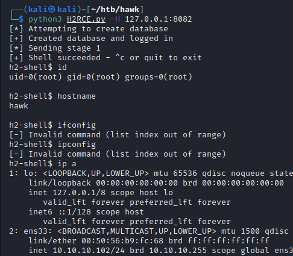

Forgot how to get the IP on linux(doh!) but we're root
