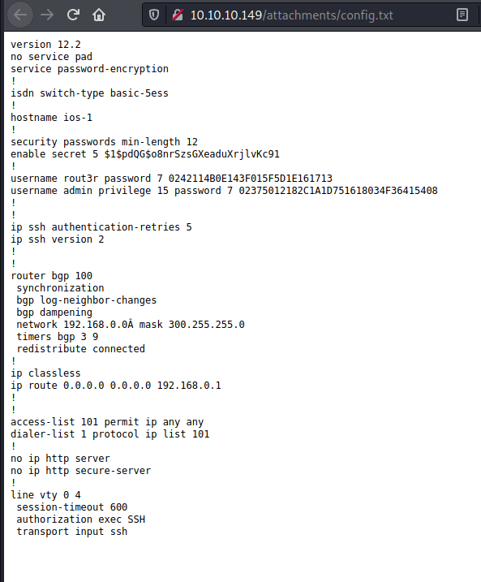

Name: Heist  
OS: Windows  
IP: 10.10.10.149  

Well this one is off to a good start.  I don't seem to have records of my nmap scan.  I do know that the open ports are 80,445, and 5985.  It seems as if we leverage some info found on the webserver paired with CME and Evil-WinRM to complete this machine.  So lets get started.  

Looking at port 80, we find a webserver, specifically a login page.  We have no credentials, but we are able to login as a guest.  The next page appears to be a ticket system, with an interesting text file.  

Looks like a Cisco config file, took some CCNA classes back during my community college and they are now proving to be useful.  Went ahead and cracked the hashes using an online service, something I only do for CTFs, not clients as passwords tend to be sensitive.

Ran the creds through CME to see what we can find.  Also found a few new user accounts using RID bruteforcing, one of the lesser known features.  

Lets check those new accounts with the previously found passwords.

  
  

Looks like we got some creds for the Chase account.  Since port 2985 is open, lets try those creds with WinRM.

  

This gave us the user flag, as well as some addtional information.  

  

Since the to-do list says 'keep checking the issue list' lets see if something is running in the background.

  
  
  

We noticed firefox was actively running, which seems odd for a CTF box. If we analyize the dump file, we find some creds.  So lets try to use them.  

Cool, and now we are system.
