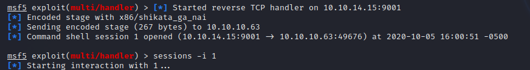
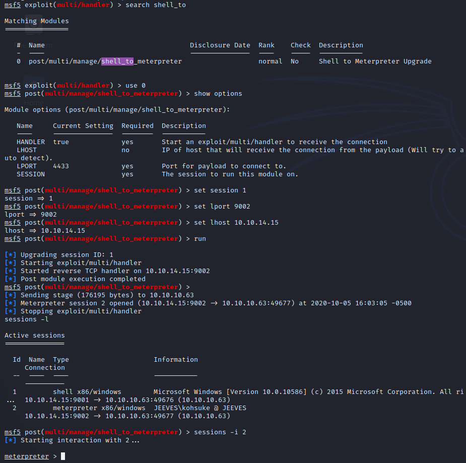

Name: Jeeves  
OS:   Windows   
IP:   10.10.10.63  

Lets start off with an nmap scan  

    sudo nmap -Pn -vv -sV -oN nmap/initial 10.10.10.63

Looks like ports 80, 135, 445, and 50000 are open.  Lets take a look at the website to start.

Nothing promising there, moving on to port 50000 next while I ran a gobuster in the background.

Nothing on this as well.  Gobustering it as well.

  

Looks promsing, lets visit it.  

Oh Jenkins, I've used this at work for a few automated workflows.  After some brief research of how to get a shell from Jenkins I stumbled upon [this article](https://www.hackingarticles.in/exploiting-jenkins-groovy-script-console-in-multiple-ways/)  

And we've gotten a shell.

Went ahead and upgraded to a meterpreter shell.  

And ran local exploit suggester

ow I seemed that I missed my next screenshot, but it appears I ran mx16_075 with the juicy varient and got a system shell.

Thanks again for following along.  Until next time.
