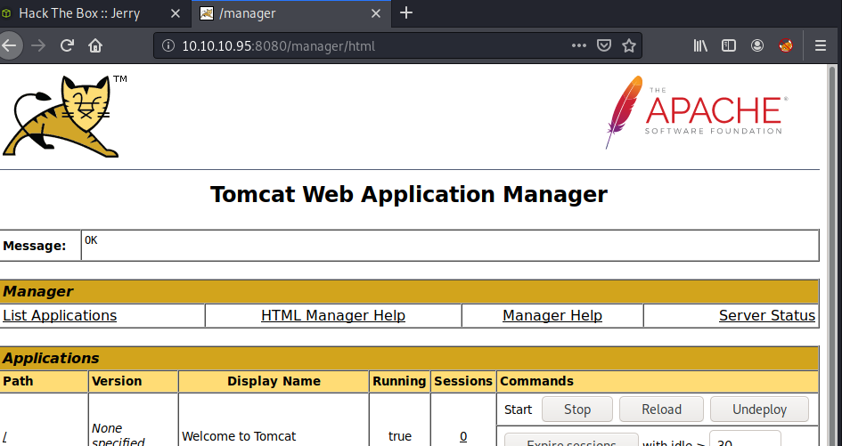

Name: Jerry  
OS: Windows  
IP: 10.10.10.95  

Another easy Windows box.  I'm not sure how long ago I did this one, but I'm pretty sure it was rather early on. So lets get started with an nmap scan.  

    sudo nmap -sC -sV -oN nmap/initial 10.10.10.95

    Starting Nmap 7.80 ( https://nmap.org ) at 2020-07-08 19:40 CDT
    Nmap scan report for 10.10.10.95
    Host is up (0.030s latency).
    Not shown: 999 filtered ports
    PORT STATE SERVICE VERSION
    8080/tcp open http Apache Tomcat/Coyote JSP engine 1.1
    |_http-favicon: Apache Tomcat
    |_http-server-header: Apache-Coyote/1.1
    |_http-title: Apache Tomcat/7.0.88

    Service detection performed. Please report any incorrect results at https://nmap.org/submit/ .
    Nmap done: 1 IP address (1 host up) scanned in 13.37 seconds

Okay, so only port 8080 is open.  Lets check it out.

Looks like the initial apache setup page

Tried to login with default creds tomcat:s3cret and it worked.. womp

I've read about uploading .war shells. lets try it here.

well that was easy...
