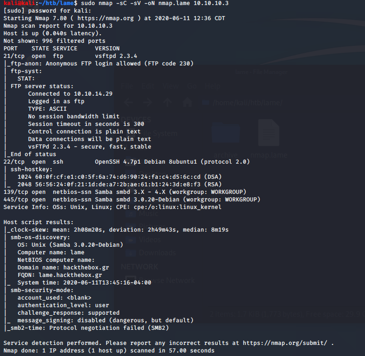
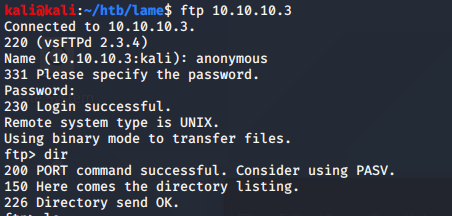
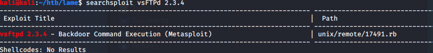
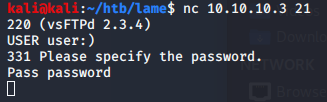
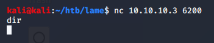
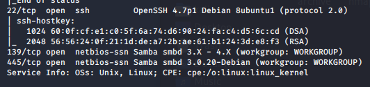
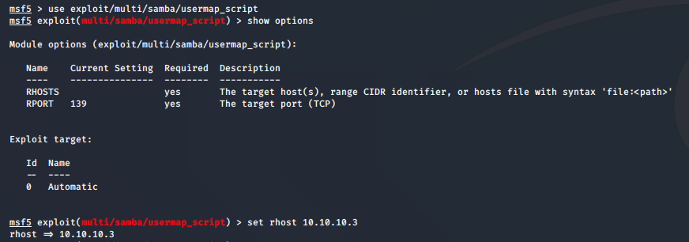
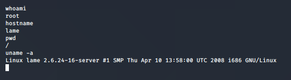

Name: Lame
OS:   Linx
IP:   10.10.10.3

Another one from the begining of my journey, appologies in advance for any issues.  Lets get started.

Started off with a Nmap scan.
used saved scripts, enum versions, output to nmap file

First thing I notice is that anonymous FTP login is allowed on port 21
However nothing appears to be listed within the directory. Searching other directorys also gives no results.

The version of this install(vsFTPd 2.3.4) sounds familiar, so I searchsploit it

Oh yeah, this backdoor that everyone uses as an introductory exploit. IIRC the username needs to end with ':)' and then it opens a backdoor on port 6200. I had issues with this in the past when I used the ftp command, pretty sure it was due to the version I had installed on my local machine

Doesn't appear to work. I don't want to spend much time on diagnosing why it doesn't work, so I'm moving on to the next port.

Port 22 is open, however SSH isn't the best attack vector when compared to SMB on 139/445.

A google search of the version 3.0.20-debian leads me to this rapid7 page
https://www.rapid7.com/db/modules/exploit/multi/samba/usermap_script
Which mentions CVE-2007-2447 as seen here
https://cve.mitre.org/cgi-bin/cvename.cgi?name=CVE-2007-2447

The Rapid7 site links to a Metasploit module
exploit/multi/samba/usermap_script so i'm going to try that first.

lets run it and we've got root.

I always want to try it without Metasploit in case I run into this on a certain unamed exam
I googled the CVE to look for some manual exploits and came across this github page
https://github.com/amriunix/CVE-2007-2447

Ran into some dependancy errors because python and I'll have to come back to this.
