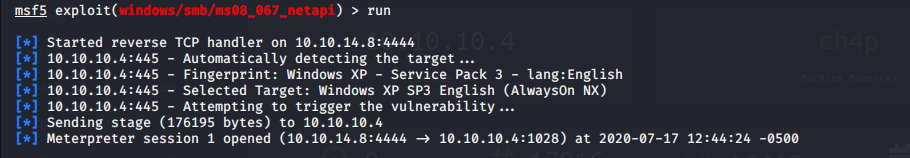
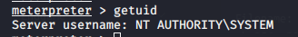

Name: Legacy
OS:   Windows
IP: 10.10.10.4

This was another fun one, shows the importance of patching/removing EoL systems.  Lets get started.

    sudo nmap -sC -sV -O -oN nmap/initial 10.10.10.4

    Starting Nmap 7.80 ( https://nmap.org ) at 2020-07-17 12:34 CDT
    Nmap scan report for 10.10.10.4
    Host is up (0.036s latency).
    Not shown: 997 filtered ports
    PORT STATE SERVICE VERSION
    139/tcp open netbios-ssn Microsoft Windows netbios-ssn
    445/tcp open microsoft-ds Windows XP microsoft-ds    
    3389/tcp closed ms-wbt-server
    Device type: general purpose|specialized
    Running (JUST GUESSING): Microsoft Windows XP|2003|2000|2008 (92%), General Dynamics embedded (87%)
    OS CPE: cpe:/o:microsoft:windows_xp cpe:/o:microsoft:windows_server_2003 cpe:/o:microsoft:windows_2000::sp4 cpe:/o:microsoft:windows_server_2008::sp2
    Aggressive OS guesses: Microsoft Windows XP SP2 or Windows Small Business Server 2003 (92%), Microsoft Windows 2000 SP4 or Windows XP SP2 or SP3 (92%), Microsoft Windows XP SP2 (92%), Microsoft Windows Server 2003 (90%), Microsoft Windows XP SP3 (90%), Microsoft Windows 2000 SP4 (90%), Microsoft Windows XP Professional SP3 (90%), Microsoft Windows XP SP2 or SP3 (90%), Microsoft Windows XP Professional SP2 (90%), Microsoft Windows XP SP2 or Windows Server 2003 (90%)
    No exact OS matches for host (test conditions non-ideal).
    Service Info: OSs: Windows, Windows XP; CPE: cpe:/o:microsoft:windows, cpe:/o:microsoft:windows_xp

    Host script results:
    |clock-skew: mean: -4h25m01s, deviation: 2h07m16s, median: -5h55m01s
    |nbstat: NetBIOS name: LEGACY, NetBIOS user: , NetBIOS MAC: 00:50:56:b9:8d:e7 (VMware)
    | smb-os-discovery:
    | OS: Windows XP (Windows 2000 LAN Manager)
    | OS CPE: cpe:/o:microsoft:windows_xp::-
    | Computer name: legacy
    | NetBIOS computer name: LEGACY\x00
    | Workgroup: HTB\x00
    | System time: 2020-07-17T17:39:40+03:00
    | smb-security-mode:
    | account_used: 
    | authentication_level: user
    | challenge_response: supported
    | message_signing: disabled (dangerous, but default)
    |_smb2-time: Protocol negotiation failed (SMB2)

    OS and Service detection performed. Please report any incorrect results at https://nmap.org/submit/ .
    Nmap done: 1 IP address (1 host up) scanned in 66.46 seconds

SMB enabled, lets check for vuln scripts

    sudo nmap --script vuln 10.10.10.4
    Starting Nmap 7.80 ( https://nmap.org ) at 2020-07-17 12:36 CDT
    Nmap scan report for 10.10.10.4
    Host is up (0.043s latency).
    Not shown: 997 filtered ports    
    PORT STATE SERVICE
    139/tcp open netbios-ssn
    |_clamav-exec: ERROR: Script execution failed (use -d to debug)
    445/tcp open microsoft-ds
    |_clamav-exec: ERROR: Script execution failed (use -d to debug)
    3389/tcp closed ms-wbt-server
    
    Host script results:
    |samba-vuln-cve-2012-1182: NT_STATUS_ACCESS_DENIED
    | smb-vuln-ms08-067:
    | VULNERABLE:
    | Microsoft Windows system vulnerable to remote code execution (MS08-067)
    | State: VULNERABLE
    | IDs: CVE:CVE-2008-4250
    | The Server service in Microsoft Windows 2000 SP4, XP SP2 and SP3, Server 2003 SP1 and SP2,
    | Vista Gold and SP1, Server 2008, and 7 Pre-Beta allows remote attackers to execute arbitrary
    | code via a crafted RPC request that triggers the overflow during path canonicalization.
    |
    | Disclosure date: 2008-10-23
    | References:
    | https://technet.microsoft.com/en-us/library/security/ms08-067.aspx
    | https://cve.mitre.org/cgi-bin/cvename.cgi?name=CVE-2008-4250
    |_smb-vuln-ms10-054: false
    |smb-vuln-ms10-061: ERROR: Script execution failed (use -d to debug)
    | smb-vuln-ms17-010:
    | VULNERABLE:
    | Remote Code Execution vulnerability in Microsoft SMBv1 servers (ms17-010)
    | State: VULNERABLE
    | IDs: CVE:CVE-2017-0143
    | Risk factor: HIGH
    | A critical remote code execution vulnerability exists in Microsoft SMBv1
    | servers (ms17-010).
    |
    | Disclosure date: 2017-03-14
    | References:
    | https://blogs.technet.microsoft.com/msrc/2017/05/12/customer-guidance-for-wannacrypt-attacks/
    | https://technet.microsoft.com/en-us/library/security/ms17-010.aspx
    | https://cve.mitre.org/cgi-bin/cvename.cgi?name=CVE-2017-0143

    Nmap done: 1 IP address (1 host up) scanned in 31.24 seconds
    
    
 Well, it appears vulnerable to MS08-067 and ms17-010.  So lets see what we can do.  Ran ms08_067 via Metasploit and got a system shell. woo!
 

 
