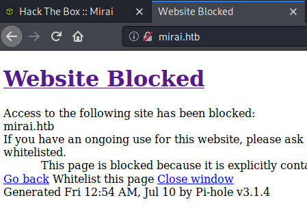
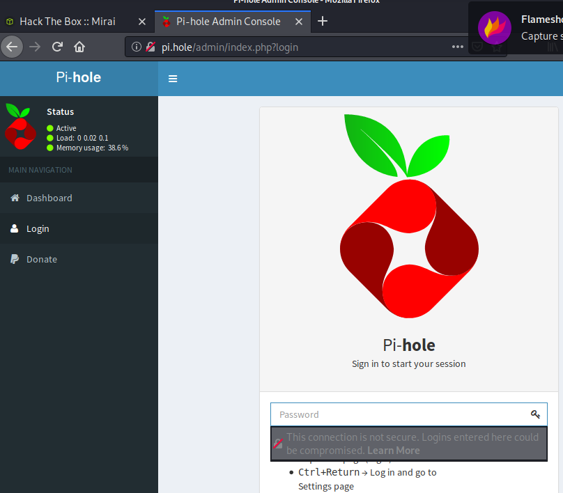
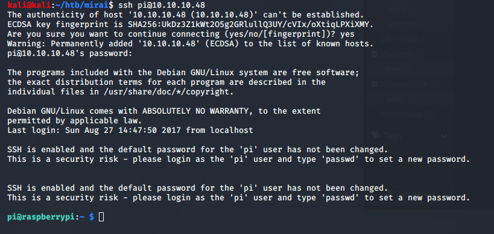

Name:   Mirai
IP:     10.10.10.48
OS:     Linux

Another rather easy one, looking back on it, this machine appears to be that of a RaspberryPi.  Based off the name, it might also have something to do with the Marai botnet.  Anywho, lets get started.  

I seem to be missing the nmap scan and screenshots, however my notes say that ports 22, 53 and 80 are open.  So SSH, DNS, and HTTP, so lets take a look at them all.  Looking at the webpage, it gives us a hint at the hostname, mirai.htb.  Digging around some of the requests via Burp and we notice a link to pi.hole.  At this point we don't know it's RaspberryPi, so we add that url to our hosts file and check it out.

Dug around on the website's login page and found nothing interesting, however we know it's a PiHole.  Combine that with the name Mirai, we look at what that is.  I found [this article](https://www.csoonline.com/article/3258748/the-mirai-botnet-explained-how-teen-scammers-and-cctv-cameras-almost-brought-down-the-internet.html) that explains it nicely.

So we go back to port 22, also known as SSH and try the default creds for a PiHole.

And we're in.  Lets start off with some basic privesc/enum commands.  Specifically sudo -l since we know the password.

Ope, and now we're root.  
