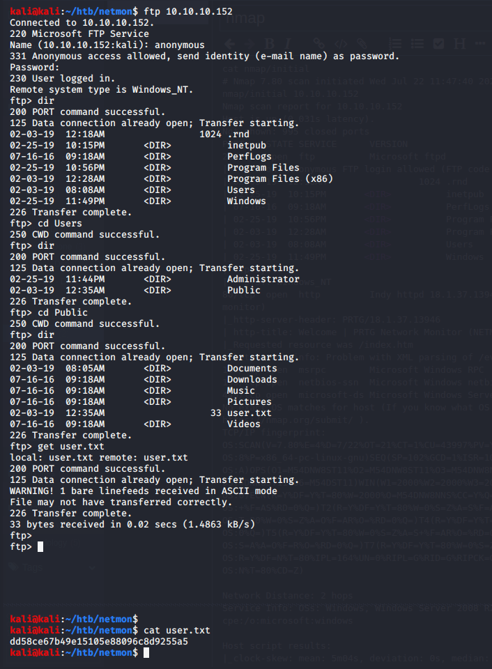

Name: Netmon
OS:   Windows
IP:   10.10.10.152

Another one from the beginning, looked pretty straight forward from my notes, so lets get started.

    sudo map -sC -sV -O -oN nmap/initial 10.10.10.152

    Nmap 7.80 scan initiated Wed Jul 22 11:47:40 2020 as: nNmap scan report for 10.10.10.152
    Host is up (0.031s latency).
    Not shown: 995 closed ports
    PORT STATE SERVICE VERSION
    21/tcp open ftp Microsoft ftpd
    | ftp-anon: Anonymous FTP login allowed (FTP code 230)
    <snip>
    |
    SYST: Windows_NT
    80/tcp open http Indy httpd 18.1.37.13946 (Paessler PRTG bandwidth monitor)
    |_http-server-header: PRTG/18.1.37.13946
    | http-title: Welcome | PRTG Network Monitor (NETMON)
    |_Requested resource was /index.htm
    |_http-trane-info: Problem with XML parsing of /evox/about
    135/tcp open msrpc Microsoft Windows RPC
    139/tcp open netbios-ssn Microsoft Windows netbios-ssn
    445/tcp open microsoft-ds Microsoft Windows Server 2008 R2 - 2012 microsoft-ds
    No exact OS matches for host (If you know what OS is running on it, see https://nmap.org/submit/ ).
    
    OS and Service detection performed. Please report any incorrect results at https://nmap.org/submit/ .

    Nmap done at Wed Jul 22 11:48:08 2020 -- 1 IP address (1 host up) scanned in 27.91 seconds
    
 Looks like we have a few ports open, port 21 jumps out to me due to the anonymous ftp access, so lets start there.
 

I found a config.old.bak file

This lead to being able to log into the system which gave me an authenticate cookie and lead me down the route of an exploit I found earlier when I searchsploited everything.

and system!

In hindsight I would have edited the script to use different creds then originally planned.  Just another layer of security.
