Name: Networked  
OS:   Linux
IP:   10.10.10.146  

Another one from the archives.  This was a fun one as I learned about magic bytes and how to 'hide' files in a sense.  Anyway, lets get started.  

    sudo nmap -Pn -vv -sV -oN nmap/initial 10.10.10.146

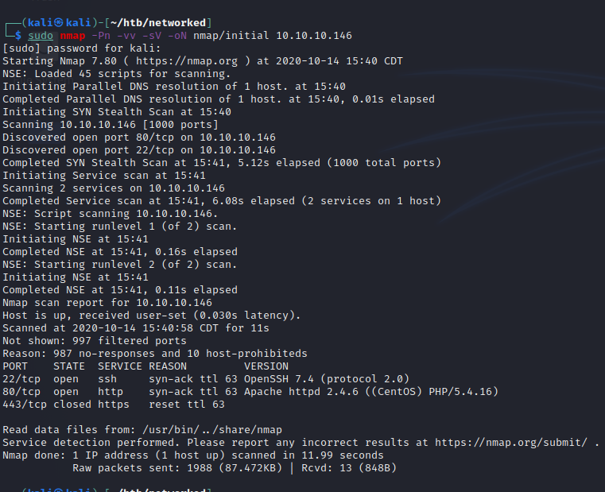

Pretty simple, lets take a look at the webserver on port 80.  While nothing jumped out initially, viewing the source-code gives us a hint.  While digging around, I also made sure to run a gobuster scan in the background.

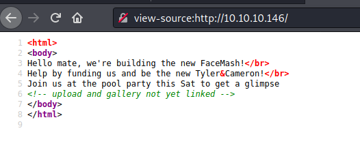
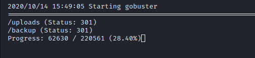

Went ahead and downloaded the .tar file and extracted it to review the contents.
d47641d830805a306d6a046252d2ef90.png)
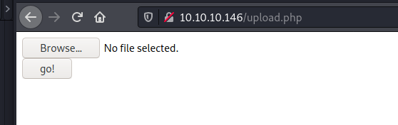

Since we've found an upload page, lets try to upload some stuff.  This took a while to figure out and I don't have many screenshots of this process, but after trying a bunch of file types, I found there was an upload filter that only allowed certain types of images.  Having some knowledge of upload bypass methods I googled for some additional ones and stumbled upon the magic bytes method.  So I used a hexeditor and changed my php file to look like a gif file.

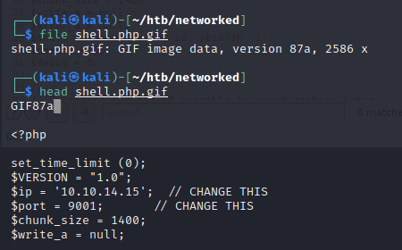

I sent the upload through Burp to watch the process(and potentially debug anything)

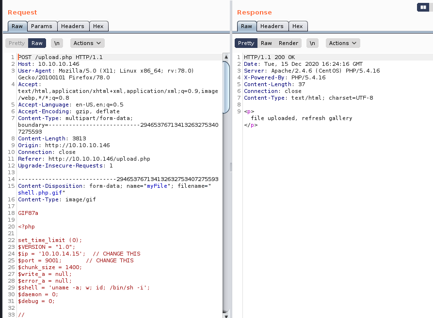

The site says it uploaded, so lets check.

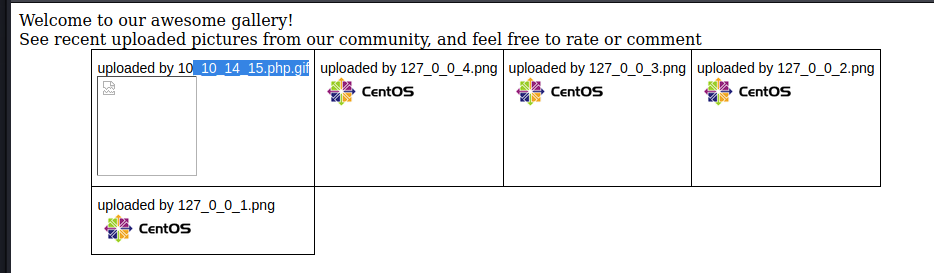

That looks good, lets try to load our shell. We browsed to our shell via firefox, annndd, got low level access.

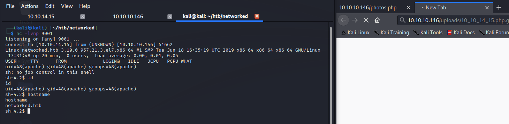

Went ahead and dropped/ran linpeas.sh
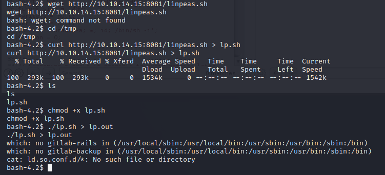

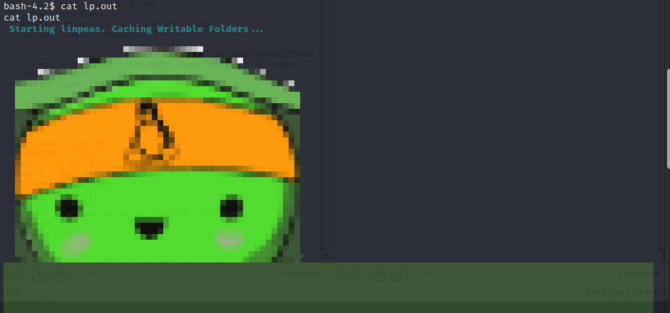

Doesn't appear to be running well. Ran through a couple of low hanging fruit commands manually and didn't find anything of note. Reviewing Guly's home directory we find a crontab/php script. Lets review those.

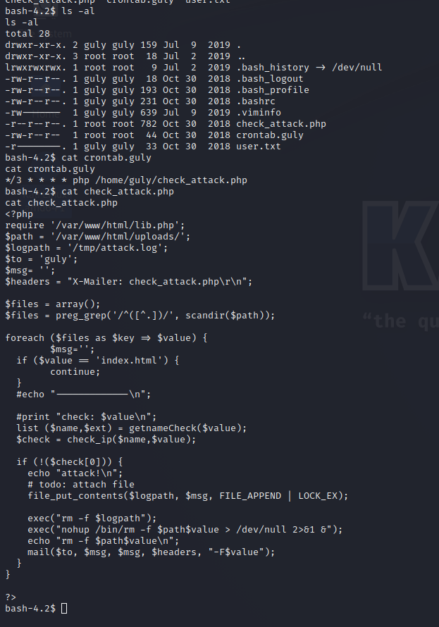

So it appears that the $value parameter isn't sanitized. Lets pass a command through.
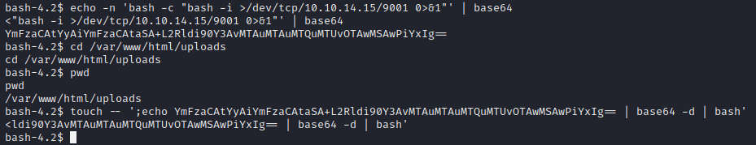

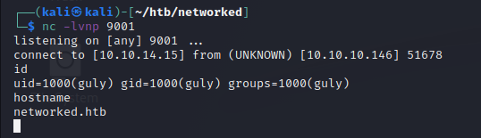

And now i'm guly. Tried a few quick checks and found out I can run changename.sh as sudo. lets take a look
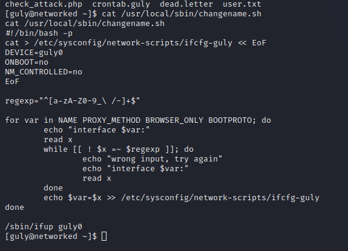

I did some digging and found this article on Seclists. Such a good site.
https://seclists.org/fulldisclosure/2019/Apr/24

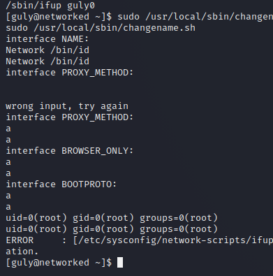  

So lets add bash instead of id and see if it works.  

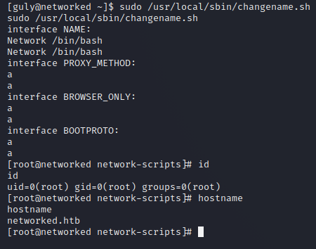  
