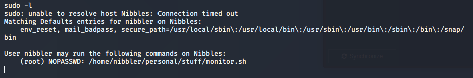

Name: Nibbles  
OS:   Linux  
IP:   10.10.10.75  

Another easy linux box.  I don't remember when I did this one, but based off the non zsh version of kali, I'd guess early 2020.  Anyway, lets get started.

    sudo nmap -sC -sV -oN nmap/initial 10.10.10.75
    and
    sudo nmap -Pn -n -sC -sV -O -oN nmap/initial 10.10.10.75
    

So ports 22, and 80.  Pretty standard, lets take a look at 80 because the version of SSH is some what up-to-date.

Hello world page, view source has something interesting

Not much here from manual review. started gobuster

http://10.10.10.75/nibbleblog/update.php

shows version 4.0.3

A search of that version lead to multiple Shell Upload articles, including a MS module from R7. Gonna try the manual way first. It appears it's authenticated, so I need to find some creds..

http://10.10.10.75/nibbleblog/content/private/users.xml
shows a username of 'admin' so that's a start

Looked everywhere GoBuster found and didn't see a password. Took a peak at the how to guide to see if it was something silly. Turns out it was set as the name of the box. Probably could have guessed that, but I never think to do that.

So we're in the web app. Lets try that upload exploit from earlier.

Uploaded, it's in the directory, lets click it

Boom, user shell

and user flag

Also noticed a 'personal.zip' in the home directory. Could be important.

Anywho, lets check some basic Linux enum stuff

sudo -l, got something interesting as well

So since that directory didn't exist, I'd try creating it for an easy win before looking into the zip file.

That didn't work, but I wanted to try one more thing.  Pretty sure I just appended "/bin/bash" to the monitor.sh script.

woo!
