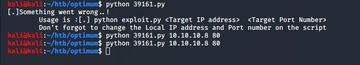
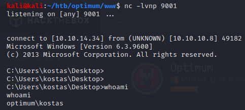
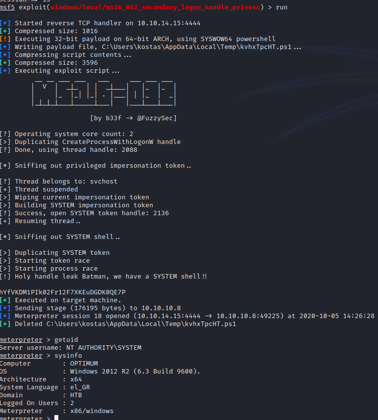
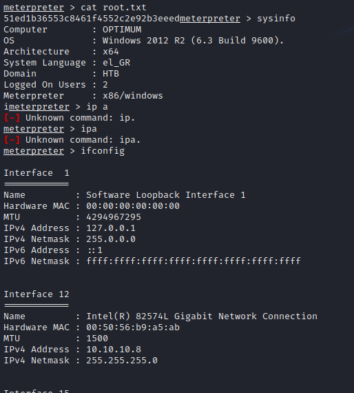

Name: Optimum
OS:   Windows
IP:   10.10.10.8  

Another fun Windows box.  Pretty sure this was a vulnerable service running on the web server that had an exploit available on ExploitDB.  We leverage that to get a low level shell and then find the OS is slightly unpatched and vulnerable to MS16_032.  Anyway, lets get started.  

    sudo nmap -sC -sV -oN nmap/initial 10.10.10.8
    
    Starting Nmap 7.80 ( https://nmap.org ) at 2020-07-25 14:29 CDT
    Nmap scan report for optimum.htb (10.10.10.8)
    Host is up (0.032s latency).
    Not shown: 999 filtered ports
    PORT STATE SERVICE VERSION
    80/tcp open http HttpFileServer httpd 2.3
    |_http-server-header: HFS 2.3
    |_http-title: HFS /
    Service Info: OS: Windows; CPE: cpe:/o:microsoft:windows  
    
    Service detection performed. Please report any incorrect results at https://nmap.org/submit/ .
    Nmap done: 1 IP address (1 host up) scanned in 12.99 seconds
    
So looking at port 80, we find it's running HttpFileServer 2.3.  If we searchsploit that, we find exploit 39161 wich allows for RCE on this version of HFS.

Looks like I pivoted to MSF which would tell me this was before I knew things about Windows.  Ran Local Exploit Suggeester and found MS16_032.

And I'm system.
