Name: Postman
OS:   Linux
IP:   10.10.160

I don't remember really anything about this box and I think I did it somehwat recently.  Lets take a look.

    sudo nmap -Pn -vv -sV -oN nmap/initial 10.10.10.160
    and
    sudo nmap -Pn -vv -p- -oN nmap/allTCP 10.10.10.160
    
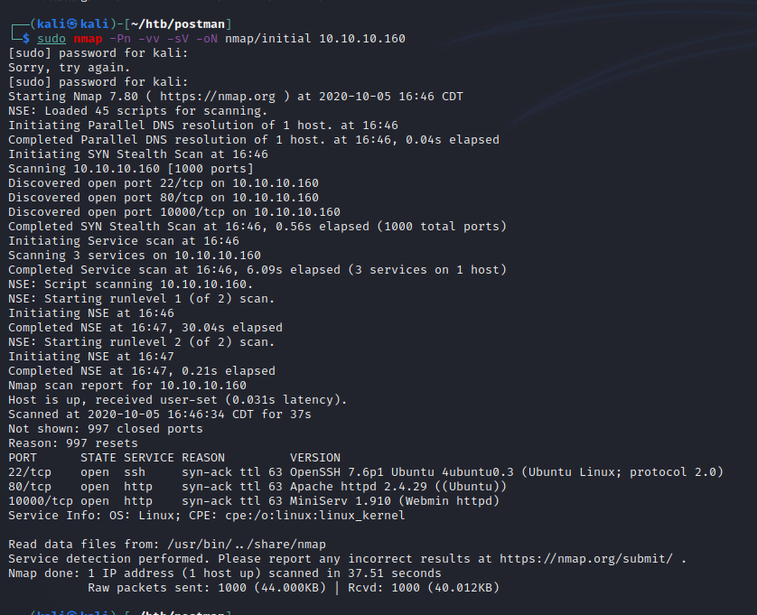
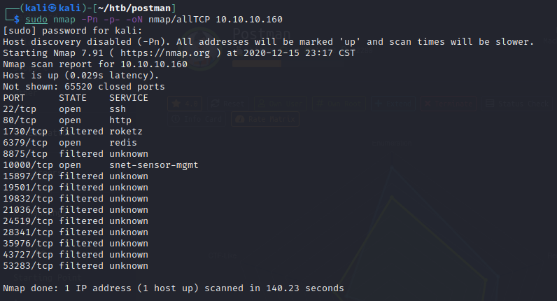
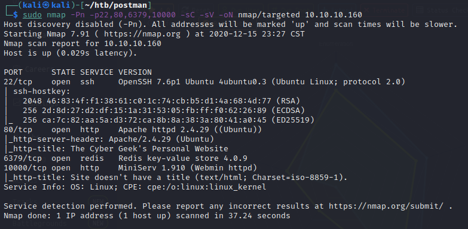

Looks like ports 22, 80, and 10000, but when we run our all ports scan we also find 6379.

Looking at port 80 we see our homepage.

Checking out port 10000 we get an error but also a redirect

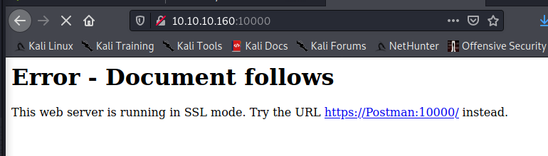

Nothing immediate jumped out. However i've added postman to my host files per the note on port 10000

port 6379 stands out as something I haven't seen before. Doing some digging we find this site
https://book.hacktricks.xyz/pentesting/6379-pentesting-redis

Following along the steps with the SSH key, we end up getting a shell

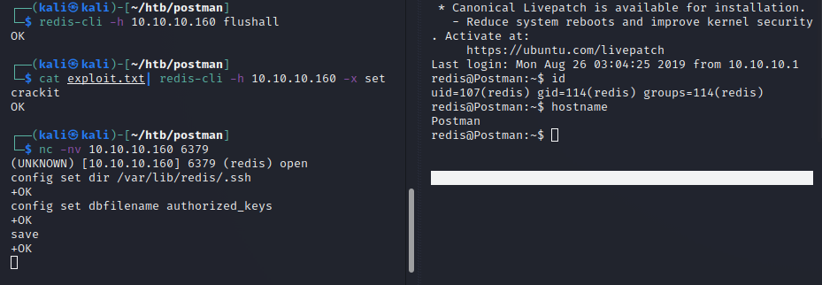

Ran through a couple quick checks, sudo, passwd, shadow file, other ssh keys and didn't find anything. lets try our enum scripts.

Looks like an interesting file within /opt/  

Copied the key over, it appears to be encrypted, so lets try john/rock you  
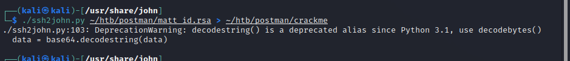
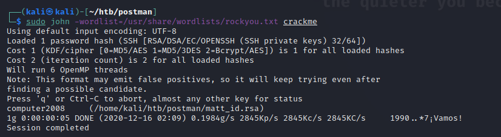

Looks like we have a way into Matt's account.

I tried the key and the connection would close immediately..  
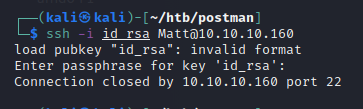

So I tried the passphrase with su back on the redis account, andddd  
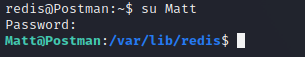

Progress!
Once again checked a couple of quick things, no sudo ability, no access to shadow/passwd, no password reuse on root. Running linpeas.sh again.

Nothing jumped out to me. Revisitng the enumeration stage, I looked at the webmin server running since it appeared to be started by root.

Checking on an unauthenticated RCE, doesn't appear to work.  
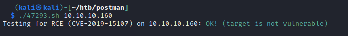

the rest listed in searchsploit are msf modules.

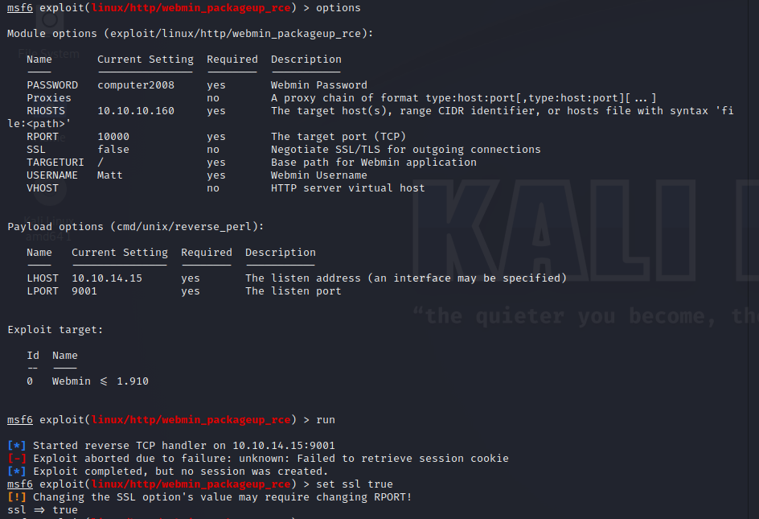

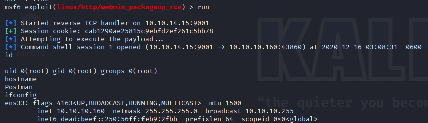

Easypeasy.

I want to revisit something I found earlier while running the linpeas.sh script.  
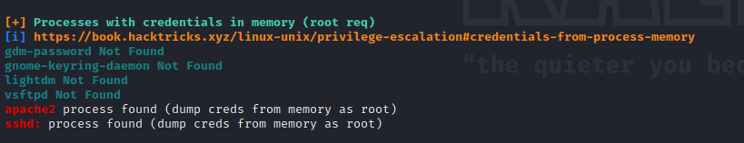

tried a few things with mimipenguins, but coudln't get it to work. Looking at the program, it appears this might fall under the limitation/bug area. Maybe i'll dig into this more in my freetime.
