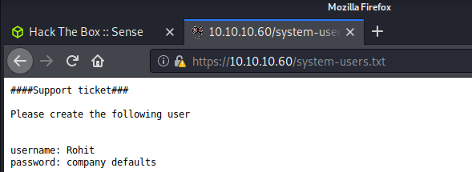
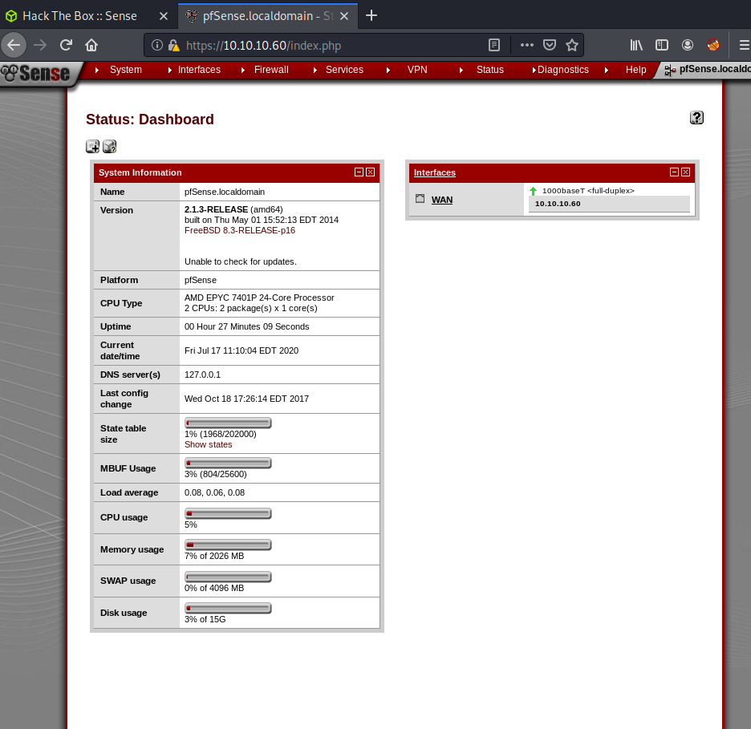
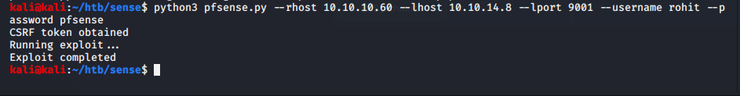
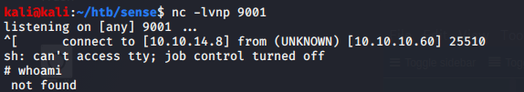
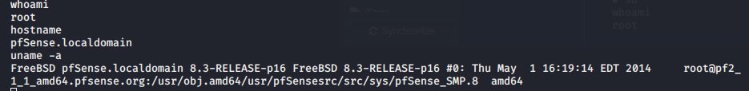

Name: Sense  
OS:   Linux  
IP:   10.10.10.60  

My notes were pretty bad on this one, based off that, i'm thinking I also did this rather early on.  I've messed with pfsense a little bit in my homelab so it's not entirely new to me, but from an attackers perspective it is.  Anyway, lets jump in.  

    Seem to be missing my initial nmap scan, I believe I found ports 80 and 443 open based off my targeted scan.
    and
    sudo nmap -sC -sV -oN nmap/targeted -p80,443 10.10.10.60
    
    
So it appears to be a webserver.  Knowing that, I probably started checking it out manually while running gobuster in the background.  This was my gobuster command.  I'm assuming port 80 just directed me to the https version, so I had to append -k to the command.
    
    gobuster dir -u https://10.10.10.60/ -w /usr/share/seclists/Discovery/Web-Content/directory-list-2.3-medium.txt -x txt -k
    

Those look promising, so lets try to log in.  Based off the phrase 'company default' I wanted to try some default-ish passwords for pfsense.  

Well, looks like I was able to get in.  When we enuerate this system some we find it's running version 2.1.3 which has a nice exploit on ExloitDB(43560).  So lets try and use that.

And now i'm root.  Pretty easy box.  Remember to change default passwords and update your systems.
