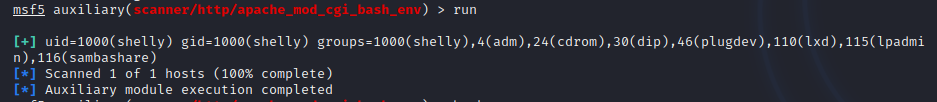
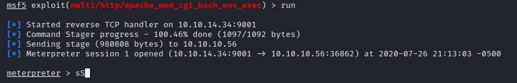
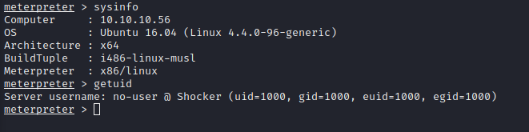
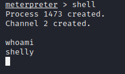
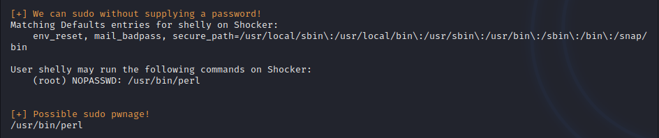
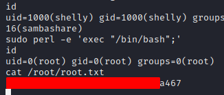

Name:   Shocker
OS:     Linux
IP:     10.10.10.56

This was a fun box, based off the name, I'm thinking we get to mess with shellshock.  A rather impactful bug discovered somewhat recently(2014).  Anyway, lets get started.

    sudo nmap -sC -sV -oN nmap/initial 10.10.10.56
    Starting Nmap 7.80 ( https://nmap.org ) at 2020-07-25 21:06 CDT
    Nmap scan report for shocker.htb (10.10.10.56)
    Host is up (0.056s latency).
    Not shown: 998 closed ports
    PORT STATE SERVICE VERSION
    80/tcp open http Apache httpd 2.4.18 ((Ubuntu))
    |_http-server-header: Apache/2.4.18 (Ubuntu)
    |http-title: Site doesn't have a title (text/html).
    2222/tcp open ssh OpenSSH 7.2p2 Ubuntu 4ubuntu2.2 (Ubuntu Linux; protocol 2.0)
    | ssh-hostkey:
    | 2048 c4:f8:ad:e8:f8:04:77:de:cf:15:0d:63:0a:18:7e:49 (RSA)
    | 256 22:8f:b1:97:bf:0f:17:08:fc:7e:2c:8f:e9:77:3a:48 (ECDSA)
    | 256 e6:ac:27:a3:b5:a9:f1:12:3c:34:a5:5d:5b:eb:3d:e9 (ED25519)
    Service Info: OS: Linux; CPE: cpe:/o:linux:linux_kernel
    
    Service detection performed. Please report any incorrect results at https://nmap.org/submit/ .
    Nmap done: 1 IP address (1 host up) scanned in 10.00 seconds
    
Okay, so it appears ports 80 and 2222 are open.  A webserver and SSH on a non-default port.  Nothing immediately jumped out on those ports, so I ran a gobuster scan.
    
       gobuster dir -u http://10.10.10.56 -w /usr/share/wordlists/dirb/small.txt
       and
       gobuster dir -u http://10.10.10.56/cgi-bin -w /usr/share/wordlists/dirb/small.txt -x txt,sh
       
Based off the machine name, I appended .sh to the extensions since we also found /cgi-bin/ in the previous scan.

We found /user.sh within that directory which is a good sign for executing Shellshock.  Lets try it.

Dropped to a usershell  

Ran LinEnum and noticed sudo -l had an interesting output.  

So lets get root.  

