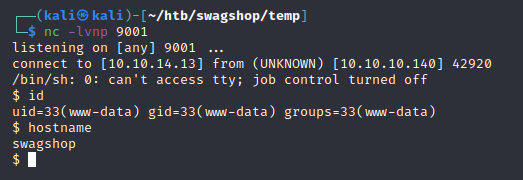

Hostname: SwagShop
OS: Linux
IP Address: 10.10.10.140
Ports Open: 22,80

Started off with an nmap scan. Found ports 22 and 80 open, so I dug into them some more.

Going to take a look at the website while running a full port scan in the background.

Looks to be a rather normal online shop site.

I went ahead and created a user on the site called test.

Started a gobuster directory scan in the background while reviewing the site.

After digging around some folders and files I wasn't making much progress. Eventually stumbled upon a program called MageScan, which can be found here:https://github.com/steverobbins/magescan

This told me it was running version 1.9 which narrowed down the searchsploit results to a few usable entries.

Stuggled with the authenticated rce, no luck with it executing properly. Went back to google. Stumbled upon CVE_2015-1397 found here: https://www.cvedetails.com/cve/CVE-2015-1397/ so I googled a github exploit and found one here: https://github.com/joren485/Magento-Shoplift-SQLI

I dropped that script into a file and ran it.

Looks like I now have access to the admin panel.

After futzing around for a while, I stumped upon this site:
(https://blog.scrt.ch/2019/01/24/magento-rce-local-file-read-with-low-privilege-admin-rights/)

In short, i added a way to upload files to the system.

To start go to Catalog > Manage products.

Choose one to edit, and select 'Custom Options' on the botto left.

From here I added an option to upload .phtml files

Following what the article said, I navigated to the file and added a command

Moved over to Burp to run more commands. Specifically a url encoded rev shell.

Cool, so I have a low level shell.

Checking some basic priv esc methods

I can run vi with a wildcard location.. I think I can exploit this somehow.

hit enter, and I should be root..

