Valentine  
Linux  
10.10.10.79  

Another one where the name/logo gave something away.  The logo for this bug is a bleeding heart, so I'll be on the lookout for a heartbleed vuln. Anyway, lets start off with an nmap scan.

    sudo nmap -sC -sV -oN nmap/initial 10.10.10.79
    
It found ports 22, 80, and 443 open.  Since heartbleed is a vuln with ssl/tls, lets look at 443 some more.

     sudo nmap --script vuln -p443 -oN nmap/targetedHTTPS 10.10.10.79
     
     Starting Nmap 7.80 ( https://nmap.org ) at 2020-07-28 08:01 CDT
     Nmap scan report for 10.10.10.79
     Host is up (0.039s latency).
     443/tcp open https
     | ssl-heartbleed:
     | VULNERABLE:
     | The Heartbleed Bug is a serious vulnerability in the popular OpenSSL cryptographic software library. It allows for stealing           information intended to be protected by SSL/TLS encryption.
     | State: VULNERABLE
     | Risk factor: High
     | OpenSSL versions 1.0.1 and 1.0.2-beta releases (including 1.0.1f and 1.0.2-beta1) of OpenSSL are affected by the Heartbleed bug. The bug allows for reading memory of systems protected by the vulnerable OpenSSL versions and could allow for disclosure of otherwise encrypted confidential information as well as the encryption keys themselves.
     |
     | References:
     | http://www.openssl.org/news/secadv_20140407.txt
     | http://cvedetails.com/cve/2014-0160/
     |_ https://cve.mitre.org/cgi-bin/cvename.cgi?name=CVE-2014-0160

     Nmap done: 1 IP address (1 host up) scanned in 37.08 seconds

Okay, so it looks vulnverably to Heartbleed, lets dive into that some more.

ran the exploit

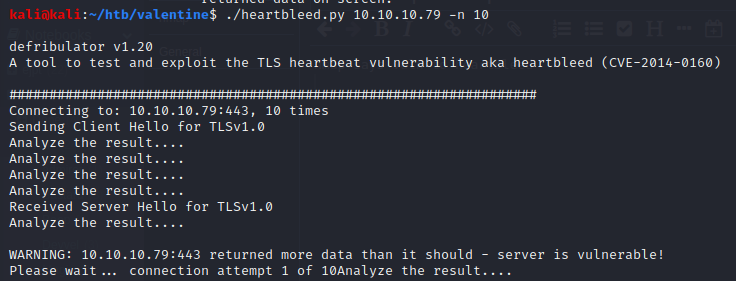
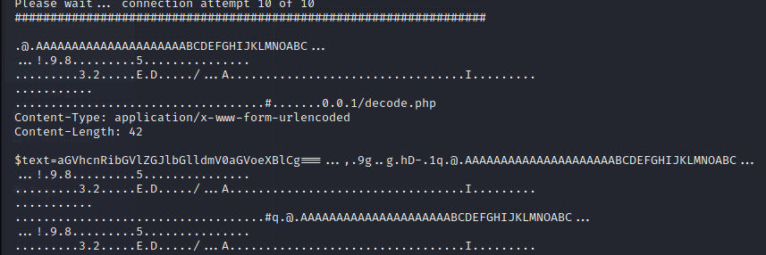

the text= looks interesting

$text=aGVhcnRibGVlZGJlbGlldmV0aGVoeXBlCg===

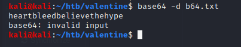

Not sure what this is for though. Nmap did have ssh open...
this would have been too easy

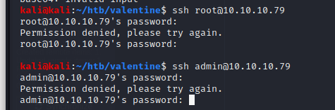

had gobuster running in the background, it found a few things.

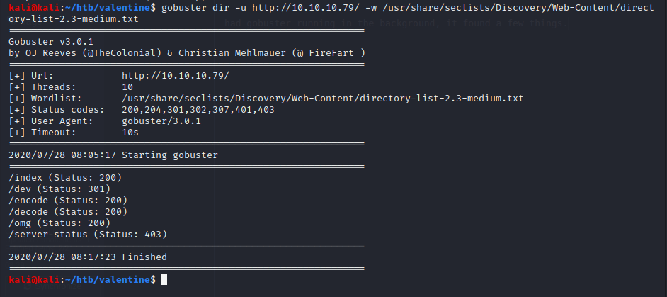

This looks promising, /dev

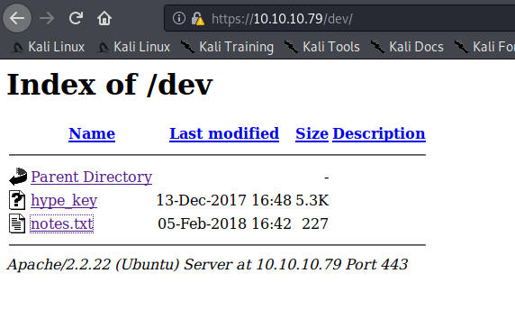

/encode

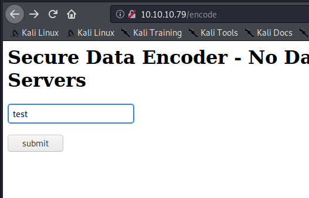

output

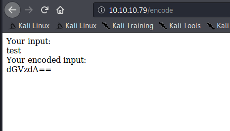

decode

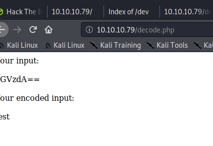

Probably could have used those sites to decode the base64 I found but eh...

Now lets go back to the /dev folder. Found this note.

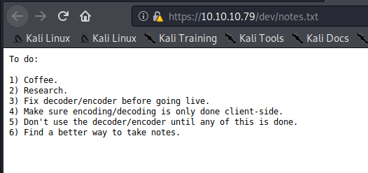

and this hex dump called hype_key

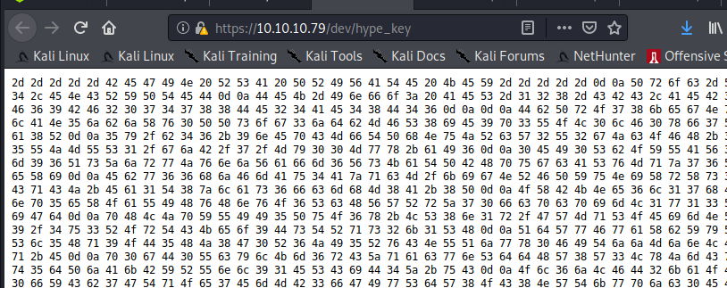

converted from hex to ascii and it appears to be a key

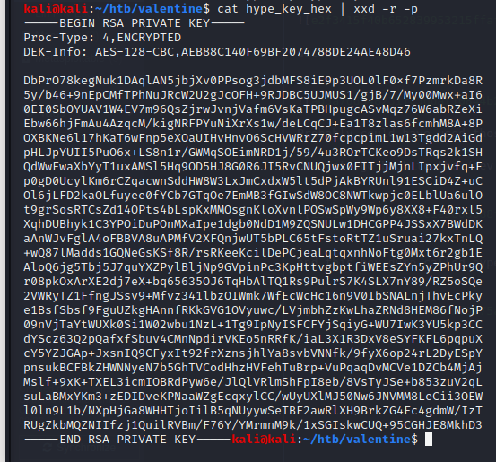

and that text value from earlier came in handy.

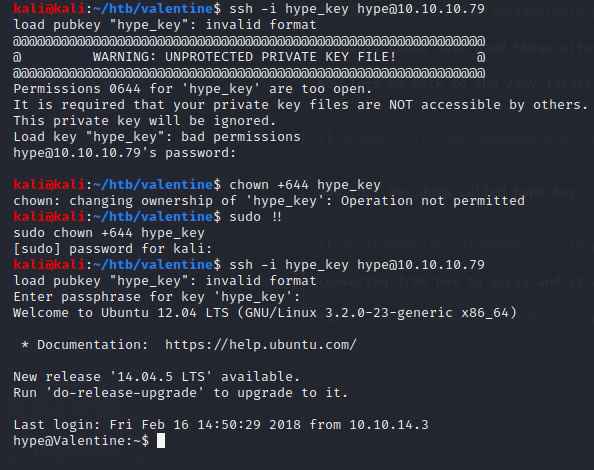

quick folder listing of / shows a .devs folder. the preceding . means it's supposed to be hidden

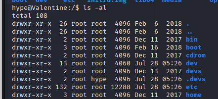

this file looks interesting.

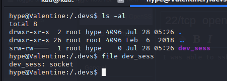

I'm not sure what a socket is. I googled 'what is a socket file linux' and got a few results

In the tmux post there was a comment about using tmux -S, so after I tried a few of the listed commands I tried that annndddd

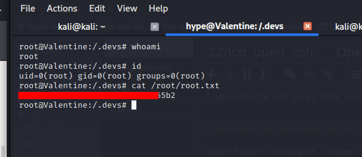

rooted
